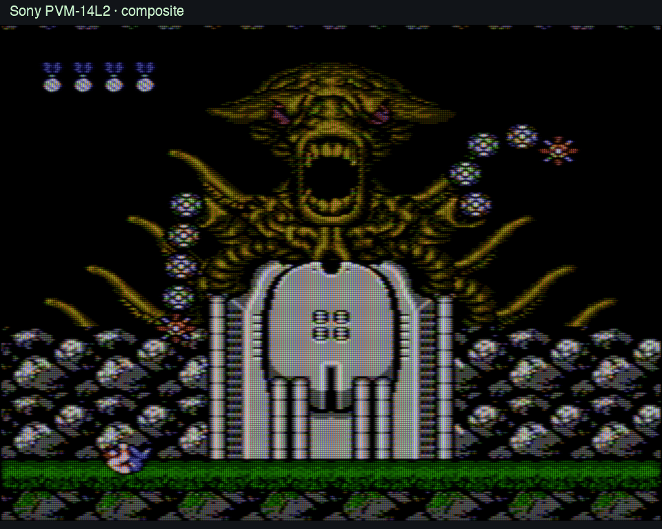
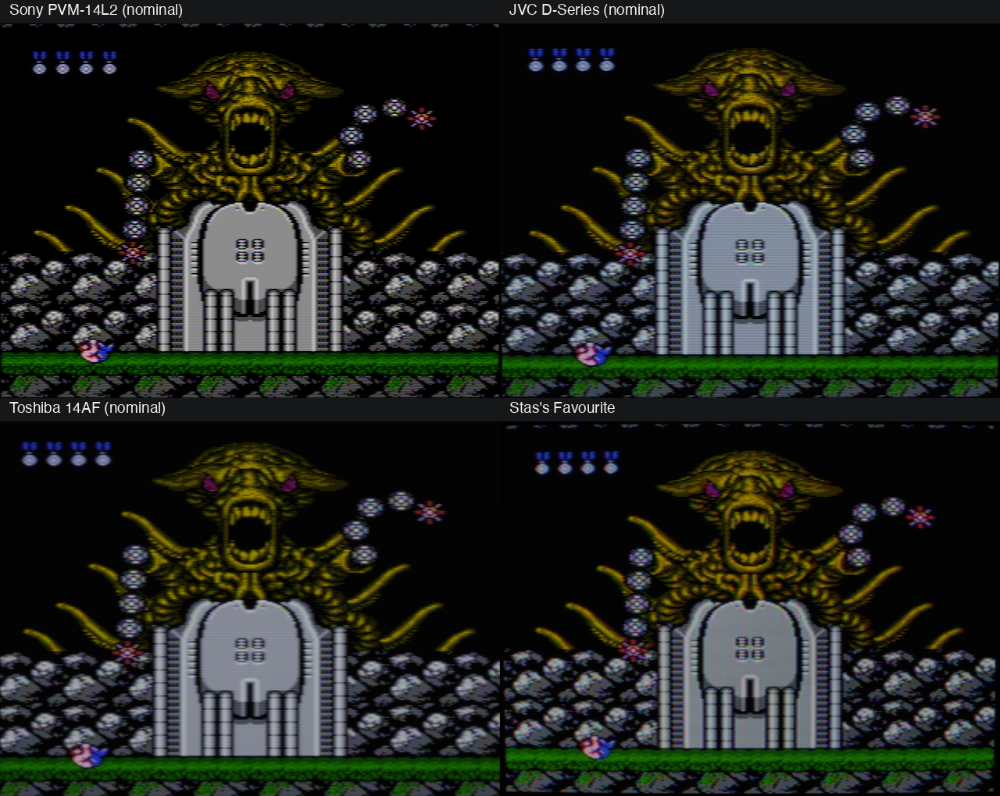
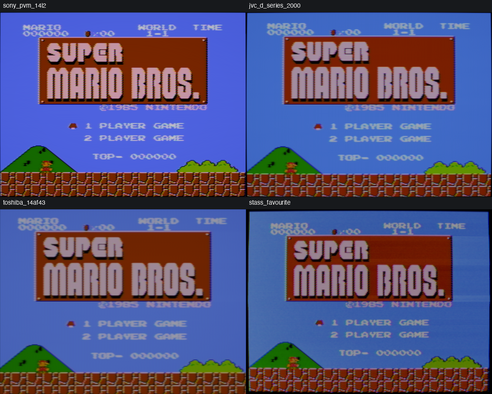

# MyNES

**A NES emulator that follows the picture from the console's video signal to the glow of a CRT.**

Play through a focused studio monitor, a soft living-room television, or a worn
RF set. MyNES builds the NES waveform from PPU colour codes, passes it through
a receiver, and renders the beam, phosphors and glass. Change the connection,
turn a control, or switch televisions while the game keeps running.

[Get started](#quick-start) · [All 20 CRT presets](docs/contra-preset-gallery.md) ·
[Signal Studio](tools/visualiser/README.md) · [How the model works](docs/gpu-pipeline-reference.md)

[](docs/images/motion/boss-sony_pvm_14l2.mp4)

*The NTSC picture changes every frame. This GIF keeps the alternating phases
instead of averaging them away. It plays 24 captured frames at 50 fps for
GIF compatibility; click for the unaveraged **60.1 fps video**.
[RF version and motion review](docs/gpu-motion-review.md).*

## Choose your television

| Start here | What it brings to the picture |
|---|---|
| **Sony PVM-14L2** | Focused beam, fine aperture grille, neutral D65 white balance, composite decoding. |
| **JVC D-Series** | Cooler whites, estimated consumer red push, slot mask and two-line comb separation. |
| **Toshiba 14AF** | Softer beam, broader highlights, slot mask and three-line comb separation. |
| **Stas's Favourite** | RF reception, imperfect convergence, bright/dark recovery and load-dependent screen contraction. |

These four are the main tuning targets. The library also includes RGB and Y/C
monitors, older household sets, worn tubes, and two curated personal looks.
Commercial names identify nominal references: individual tube condition and
many circuit responses remain estimates. [Preset settings and evidence](docs/gpu-preset-audit.md).

[](docs/contra-preset-gallery.md)

*Four views of the same Contra boss. These comparison stills average two NTSC
phases in linear light; the animation above preserves their alternation.
[All 20 presets, full resolution and close-ups](docs/contra-preset-gallery.md).*

[](docs/images/readme-mario.png)

*Mario's flat sky, white lettering and brickwork expose differences in colour,
focus and recovery that a dark scene can hide. Same capture exposure for every preset.*

## Follow the signal

```text
PPU colour codes → NES DAC waveform → cable / RF receiver → Y/C separation
                 → colour decoder → RGB amplifiers → beam & phosphors
                 → mask & glass → SDR / HDR display
```

- **A waveform before a picture.** The stock NES video path starts from measured
  DAC voltage levels, with NTSC/PAL phase and colour emphasis. Composite and RF
  artefacts emerge from signal processing. Ideal modified RGB, component and
  Y/C sources are also available.
- **CRT structure that responds to the image.** Beam width grows with current;
  bright areas can affect focus, recovery and raster size. Aperture grilles,
  slot masks and shadow masks give the display its texture. Mask sampling
  follows the actual viewport and host-display scale.
- **Light and sound through the set.** Phosphor decay, glass scatter, ambient
  black and available HDR headroom shape the output. The audio path models
  console filtering, cable, amplifier and generic speaker responses, with
  CPU and GPU processing options.
- **A live editor.** The in-game OSD and native macOS Signal Studio expose the
  chain's controls. Switch presets, save your own, rename them, and see which
  preset is active without restarting the game.
- **An inspectable emulator.** Cycle-by-cycle CPU microcode, a dot-stepped PPU,
  tracing, tests, offscreen captures and repeatable benchmarks underpin the
  visual experiments.

The GPU frontend is actively developed and playable; it is also a signal-chain
laboratory. The lightweight SDL2 frontend remains available. On the tested
Apple M5, complete offscreen Contra playback with emulation and audio sustained
about 60 fps at 2560×1664 across the four main profiles. See the
[benchmark methodology and limits](docs/gpu-benchmark-results.md), including
GPU timings and periodic capture overhead.

Still images cannot reproduce CRT motion on an LCD, and these presets are not
measurements of twenty individual televisions. RF is an equivalent baseband
model, not a complete tuner simulation. The [model reference](docs/gpu-pipeline-reference.md)
records those boundaries alongside the implemented stages.

## Play on a real CRT, too

The SDL2 frontend can stream PPU frames over USB to a programmed Tang Nano 20K
while keeping the Mac preview running. Build with `-DNES_CRT_USB=ON`, then launch
`./build-crt/bin/mynes --crt-usb your-ntsc-rom.nes`.
See [setup and hardware requirements](docs/crt-usb.md).

## Quick Start

### Prerequisites

Required for the core and tests:

- CMake 3.16+
- A C11 compiler
- Chicken Scheme (`csi`) if you want to regenerate CPU code from the DSL
  locally. Pre-generated CPU code is committed as a fallback.

Optional frontends/tools:

- SDL2 development headers for `mynes`
- SDL3 development headers for `mynes_gpu`
- `glslc` for GLSL to SPIR-V shader compilation
- `spirv-cross` for SPIR-V to Metal Shading Language on macOS

### Build

Use an out-of-source build:

```bash
mkdir build
cd build
cmake ..
cmake --build . -j
```

On macOS, CMake resolves the SDK from the selected developer tools and
defaults the minimum deployment version to the running macOS version.
An explicit `-DCMAKE_OSX_DEPLOYMENT_TARGET=...` overrides this default;
dependencies must support that version too.

The main build options are:

```bash
cmake .. -DNES_BUILD_TESTS=ON        # default: ON
cmake .. -DNES_BUILD_FRONTENDS=ON    # default: ON
cmake .. -DNES_BUILD_GPU_FRONTEND=ON # default: OFF, requires SDL3
```

### Run

From the build directory:

```bash
./bin/mynes                  # open the fullscreen ROM browser
./bin/mynes path/to/game.nes # run a ROM directly
```

The repository does not include commercial ROMs. Keep local ROMs in
`roms/`; that directory is ignored by git.

### GPU Frontend

Build with SDL3 support enabled:

```bash
cmake .. -DNES_BUILD_GPU_FRONTEND=ON
cmake --build . -j
```

Run it the same way:

```bash
./bin/mynes_gpu
./bin/mynes_gpu path/to/game.nes
```

Shaders are built automatically into the build tree. To rebuild them
manually from the repository root:

```bash
./frontends/gpu/shaders/compile_shaders.sh
```

The GPU frontend restores its last preset from
`~/.config/mynes/config.json`. Press **M** in-game for the on-screen
signal-chain menu, **P** to cycle presets, **C** to switch composite/raw
views, **Shift+C** for split view, and **O** to reopen the ROM browser.
Changing presets displays the selected name for three seconds. Bundled presets
load relative to the executable (`build/presets`), independently of the launch
directory; personal presets remain in `~/.config/mynes/presets`.

### Live signal editor (macOS)

```bash
# From the repository root, in separate terminals:
./build/bin/mynes_gpu --debug-server path/to/game.nes
swift run --package-path tools/visualiser -c release
```

See [Signal Studio](tools/visualiser/README.md) for preset management and controls.

## Architecture

The core is platform-agnostic C11. SDL, GPU APIs, audio devices, windows,
and file browsers live in `frontends/`; the emulator library itself does
not depend on them.

**CPU:** `src/cpu/nes6502.dsl` describes all official and unofficial
6502 opcodes as reusable cycle patterns. `tools/dsl2c.scm` generates
`cpu_step()` and bus-introspection helpers such as "what address would
the next read use?" and "is the next microcycle a write?". That derived
knowledge is used by DMC DMA and edge-case store instructions instead of
maintaining a second hand-written timing model.

**System timing:** `src/nes/nes.h` is the master scheduler. Each
`nes_step()` advances one CPU cycle worth of master-clock time, interleaves
PPU dots around CPU bus access, handles OAM DMA and DMC DMA cycle
stealing, propagates APU/mapper IRQs, and dispatches debug hooks.

**PPU/APU/mappers:** the PPU runs dot-by-dot, the APU produces filtered
audio, and cartridge mapper logic is isolated behind a mapper interface.
The supported mapper set is focused on real games and test ROMs rather
than trying to cover every board at once.

**Composite video:** `src/nes/composite.h` is the CPU path used by the
SDL2 frontend, headless renderer, and tests. It generates the 2C02/2C07
waveform, bandwidth-limits it, demodulates chroma, matrix-decodes it, and
applies the lightweight display treatment needed for real-time play.

**GPU signal chain:** `frontends/gpu/` contains the SDL3 signal-chain frontend.
PPU codes drive a measured voltage model, followed by the NTSC/PAL raster,
receiver sync/burst recovery, Y/C decoding, RGB amplifiers, CRT supply/loading,
beam deposition, phosphor decay, mask, glass, and SDR/HDR output. Emulation and
audio run independently of presentation. Presets and live controls are available
in the OSD and Signal Studio.

See the [model and its limits](docs/gpu-pipeline-reference.md) and
[benchmarks](docs/gpu-benchmark-results.md), [hardware research](docs/gpu-hardware-research.md),
and [visual review](docs/gpu-visual-review.md). The current
[20-preset gallery](docs/contra-preset-gallery.md) includes the strengths and
remaining weaknesses visible in the renders.

## Tests

Build with tests enabled, then run:

```bash
ctest --test-dir build --output-on-failure
```

Useful individual targets and tools:

```bash
cmake --build build --target test_cpu test_cpu_cycles test_ppu test_nes test_rom
cmake --build build --target accuracy_coin
./build/bin/accuracy_coin # all 144 AccuracyCoin tests; failures return nonzero
./build/bin/accuracy_coin tests/accuracy_coin/AccuracyCoin.nes 14 # one page
./build/bin/test_runner tests/nes-test-roms/.../some-test.nes --blargg
```

GPU-related tests are available when `NES_BUILD_GPU_FRONTEND=ON`:

```bash
ctest --test-dir build -R '^gpu_' --output-on-failure
```

## Documentation

- [Architecture overview](docs/architecture/overview.md) explains the core
  components and data flow.
- [Timing](docs/architecture/timing.md) covers master-clock scheduling,
  DMA, interrupts, and region timing.
- [Testing infrastructure](docs/architecture/testing.md) describes unit,
  AccuracyCoin, Blargg, script, and trace workflows.
- [DSL design](docs/dsl-design.md) and
  [DSL reference](docs/dsl-reference.md) explain the CPU microcode
  language and compiler.
- [GPU pipeline design](docs/gpu-pipeline-design.md) and
  [pipeline reference](docs/gpu-pipeline-reference.md) document the
  palette-index-to-phosphor path.
- [GPU frontend design](docs/gpu-frontend-design.md) preserves the design
  plan and implementation notes for the SDL_GPU frontend.
- [Blog notes](docs/blog/) are a narrative series about the emulator's
  main ideas: timing as data, compiler-derived DMA behaviour, composite
  signal generation, CRT stages, comb filtering, beam physics, presets,
  and why the CPU and GPU pipelines both exist.
- [Debugging workflows](docs/debugging/common-workflows.md) and
  [development commands](docs/dev/commands.md) are the operational guides.

## Project Layout

```text
include/nes/              Public API headers
src/cpu/                  6502 DSL source and generated CPU interface
src/nes/                  System integration, APU, mappers, ROM loading,
                          composite video, hooks, tracing
src/ppu/                  Dot-accurate PPU
frontends/sdl/            SDL2 playable frontend
frontends/gpu/            SDL3 + SDL_GPU analog signal-chain frontend
frontends/headless/       Non-interactive runner
tests/                    Unit tests, integration tests, AccuracyCoin,
                          and test ROM fixtures
tools/                    DSL compiler, test runner, visualiser tools
docs/                     Architecture, debugging, GPU pipeline, and blog notes
presets/                  GPU frontend physical display presets
```

## Origins

MyNES is a ground-up C11 rewrite of a NES emulator first written in 2012.
The original is preserved on the [`legacy`](https://github.com/yaglo/mynes/tree/legacy)
branch. The rewrite combines declarative CPU timing with signal-based video.

## License

See [LICENSE](LICENSE).
