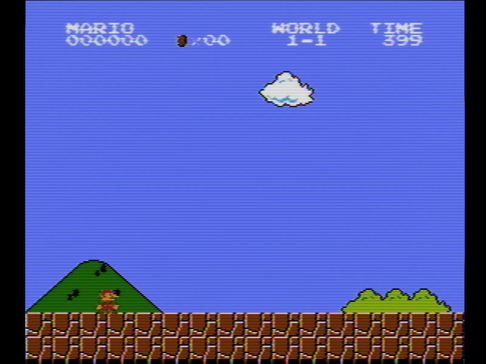
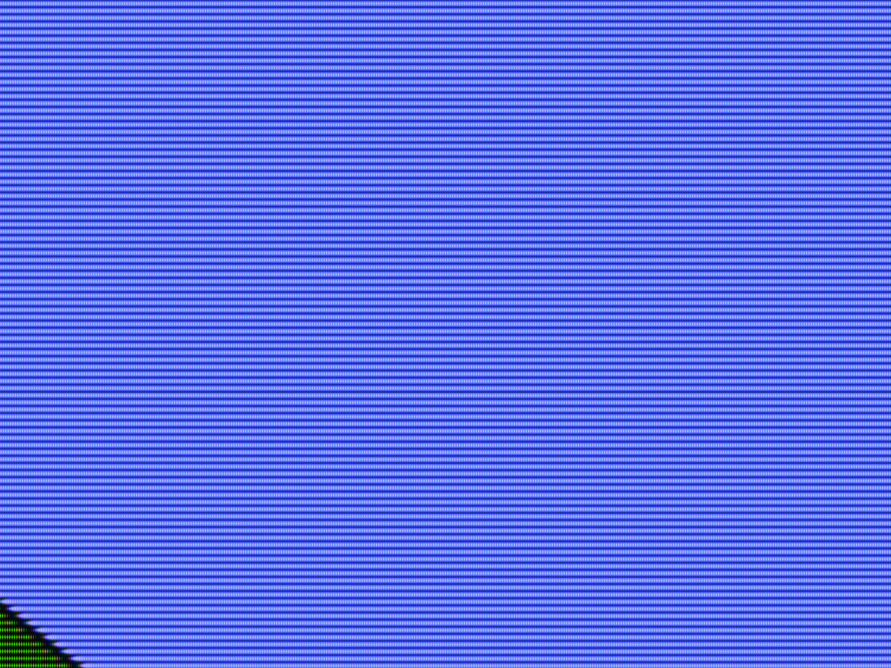

# MyNES

MyNES is an NES emulator that generates the console's composite video signal,
decodes it the way a television would, and draws the beam, phosphors, mask and
glass of a CRT. The emulation core is cycle accurate: it passes 144 of 144
[AccuracyCoin](tests/accuracy_coin/README.md) tests and blargg's
`instr_test-v5`, `apu_test` and PAL APU suites.



Preview: Super Mario Bros., World 1-1, on the Sony PVM-14L2 preset. The
emulator rendered the frames at 1600×1200; the clip plays every second frame
of the first 5 seconds at 30 fps and is shown at 800 CSS pixels, so a 2×
display shows one render pixel per device pixel and nothing is scaled.

Flicker warning: the detail crop below alternates NTSC phases at 8 frames per
second.



The crop is 1500×1125 render pixels, cut 1:1 from 3840×2880 frames, 8
consecutive frames with the alternating NTSC phases kept separate. The
[Gallery](https://yaglo.github.io/mynes-web/gallery/) of the
[project site](https://yaglo.github.io/mynes-web/) shows every television
preset with 1:1 crops and 3840×2880 full frames, and the home page switches
televisions while a game runs.

## Features

- CPU: all official and unofficial 6502 opcodes are described as cycle
  patterns in a small DSL, and a compiler generates the C code.
- Video signal: PPU color codes drive a measured DAC model. The waveform goes
  through a cable or RF path, an optional VHS deck, comb or notch Y/C
  separation, the color decoder and the RGB amplifiers before it reaches the
  tube model.
- Tube: beam width grows with beam current, bright areas load the supply, and
  phosphors decay. The mask is an aperture grille, a slot mask or a shadow
  mask.
- Presets: 24, including a Sony PVM-14L2, a 1981 Zenith on RF, a worn RF set
  and a VHS recording.
- Play: gamepads with hot-plug, 2 players, battery saves, save-state slots,
  fast-forward, NTSC and PAL, an on-screen menu for every control, and a
  native macOS editor for the whole chain.

Supported mappers: 0, 1, 2, 3, 4, 5, 7, 9, 10, 11, 34, 66, 69, 71, 206 and 227
(NROM, MMC1, UxROM, CNROM, MMC3, MMC5, AxROM, MMC2, MMC4, Color Dreams,
BNROM/NINA-001, GxROM, FME-7, Camerica, DxROM and the 1200-in-1 board).
Unsupported boards report their mapper number in the ROM browser.

## Download

No binaries are published yet. On macOS and Linux, build from source as shown
below. Windows is untested. No commercial game ROMs are included; the ROMs
under `tests/` are test suites, homebrew games and demos.

## Build from source

### macOS

```bash
brew install cmake
git clone https://github.com/yaglo/mynes.git && cd mynes
cmake -S . -B build && cmake --build build -j
./build/bin/mynes_gpu path/to/game.nes
```

The first configure downloads and builds a pinned SDL3. `glslc` and
`spirv-cross` are optional; without them the build uses the committed shader
binaries.

### Linux (Vulkan)

```bash
sudo apt install build-essential git cmake pkg-config libvulkan-dev \
    libx11-dev libxext-dev libxrandr-dev libxcursor-dev libxfixes-dev \
    libxi-dev libxss-dev libxtst-dev libwayland-dev libxkbcommon-dev \
    libdecor-0-dev libegl-dev libgl-dev libpulse-dev libasound2-dev
git clone https://github.com/yaglo/mynes.git && cd mynes
cmake -S . -B build -DMYNES_BUNDLED_SDL3=ON && cmake --build build -j
./build/bin/mynes_gpu path/to/game.nes
```

[docs/dev/commands.md](docs/dev/commands.md) lists the build options, the
headless CI recipe and the SDL2 frontend.

## Controls

| Action | Keyboard | Gamepad |
|---|---|---|
| D-pad, A, B | Arrows, X, Z | D-pad or left stick, East, South |
| Select, Start | Tab, Return | Back, Start |
| Menu | Escape or M | Guide |
| Pause | Space | |
| Fast-forward (hold) | ` (grave) | Right shoulder |
| Save state, load state, next slot | F5, F7, F6 | |
| Reset, room reflections, next preset | R, G, P | |
| ROM browser, fullscreen, screenshot | O, F, F12 | |

Player 2 uses W/A/S/D with J, H, U and Y, or the second gamepad.

The full map, including player 2, gamepad buttons, save states and the
developer keys, is in [docs/gpu-controls.md](docs/gpu-controls.md).

## How the picture is made

```text
PPU color codes → NES DAC waveform → cable / RF → optional VHS tape
                → TV receiver → Y/C separation → color decoder → RGB amplifiers
                → beam & phosphors → mask & glass → SDR / HDR display
```

The stages from the DAC to the phosphors are compute shaders; the mask, glass
and SDR/HDR output are one final fragment pass. The generic filter kernels
(pointwise, RC, FIR, delay, modulator and PAL chroma) have CPU reference
implementations, and GPU fidelity tests check the other stages against
analytic and measured expectations. The
[pipeline reference](docs/gpu-pipeline-reference.md) lists every stage and its
limits. The [blog series](https://yaglo.github.io/mynes-web/blog/) covers the
6502 timing DSL, DMA timing in the DSL compiler, the composite waveform and
the size of the beam spot.

## Performance

On an Apple M5 (24 GiB, Metal, Release build, measured 2026-09-23), the full
GPU chain takes a median 11.2 ms per frame for the Sony PVM-14L2 preset at
2560×1920 and 6.7 ms at 1920×1440. The JVC D-Series, Toshiba 14AF and Stas's
Favourite presets take 13.4 to 14.6 ms at 2560×1920. The display pass costs
about 4 ms more than on 2026-09-21 since each color is drawn on the panel's
own subpixel and the output shoulder is computed per triad. The render scale
setting (1, 0.75, 0.5 or auto) draws the beam and phosphor stages at that
fraction of the viewport. Auto steps down when the GPU time per frame stays
above 90% of the frame interval. The method and raw data are in the
[benchmark results](docs/gpu-benchmark-results.md).

## Tests

```bash
ctest --test-dir build --output-on-failure
```

Unit tests, mapper tests, PAL APU ROM tests, the complete AccuracyCoin suite
and the GPU kernel and preset tests run through GitHub Actions on Ubuntu and
macOS on every push to `master` and every pull request. The GPU pipeline,
audio, fence, playback and frame-capture tests run in CI on Ubuntu only, on
lavapipe (software Vulkan); the macOS job skips those and runs the rest of
the GPU tests. `gpu_fidelity_tests` needs a hardware GPU and runs outside CI.

## Documentation

- [Architecture](docs/architecture/overview.md), [timing](docs/architecture/timing.md),
  [mappers](docs/architecture/mappers.md), [testing](docs/architecture/testing.md)
- [CPU DSL design](docs/dsl-design.md) and [reference](docs/dsl-reference.md)
- [GPU pipeline design](docs/gpu-pipeline-design.md) and [reference](docs/gpu-pipeline-reference.md)
- [Controls and menus](docs/gpu-controls.md), [Signal Studio](tools/visualiser/README.md)
- [Showcase pipeline](tools/showcase/README.md): the site's clips, stills and
  crops, recorded at every size they are shown at
- [Debugging workflows](docs/debugging/common-workflows.md), [commands](docs/dev/commands.md)
- Galleries, hardware research and the blog:
  [yaglo.github.io/mynes-web](https://yaglo.github.io/mynes-web/)

## Project layout

```text
src/cpu/            6502 DSL source
src/nes/            System, APU, mappers, ROM loading, composite video
src/ppu/            Dot-accurate PPU
generated/          Pre-built CPU code from the DSL
frontends/gpu/      SDL3 signal-chain frontend and shaders
frontends/sdl/      SDL2 frontend
frontends/headless/ run_rom: runs a ROM for N frames and saves a screenshot
frontends/shared/   Config, ROM browser, saves
presets/            Television and monitor presets (JSON)
palettes/           NES color palettes (.pal)
tests/              Unit tests, AccuracyCoin, test ROMs
tools/              DSL compiler, test runner, benchmark, Signal Studio,
                    showcase pipeline, review scripts, SPICE circuits,
                    CRT measurements
scripts/            Release and test-runner scripts
cmake/              Build modules, bundled SDL3 patches, shader steps
docs/               Developer documentation
```

## History and license

MyNES began in 2012. The current core is a C11 rewrite, and the original is
on the [`legacy`](https://github.com/yaglo/mynes/tree/legacy) branch.
[Contributing](CONTRIBUTING.md) · Apache-2.0 [license](LICENSE)
