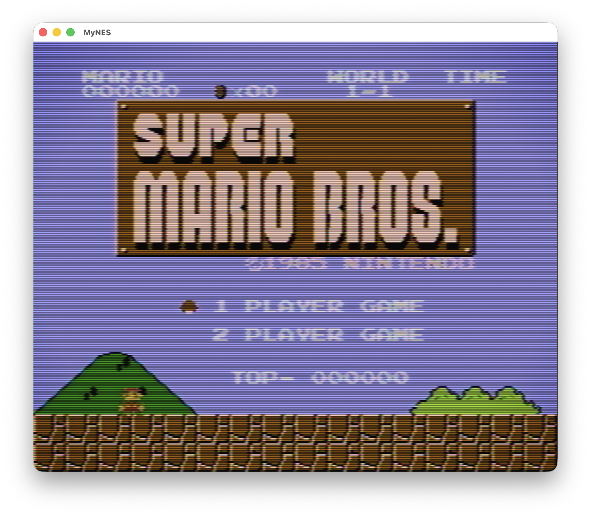
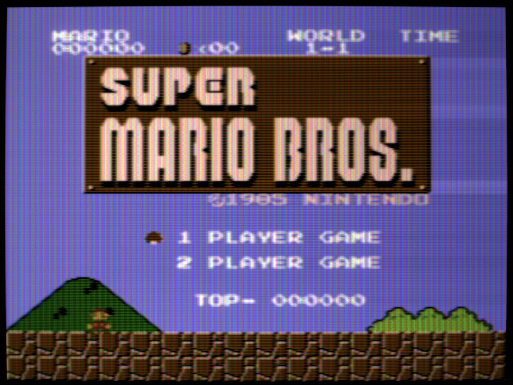

# MyNES

MyNES is a ground-up C11 rewrite of a NES emulator I first wrote in
2012. The old code is preserved on the
[`legacy`](https://github.com/yaglo/mynes/tree/legacy) branch; this
branch is the clean-start version.

The rewrite has two ideas behind it:

1. **Timing is data.** The 6502 CPU is described as declarative
   microcode in a small Scheme-compiled DSL. The compiler generates the
   cycle-by-cycle C state machine, including helper knowledge the rest of
   the emulator needs for DMA, dummy reads, interrupt timing, and bus
   side effects.
2. **Video starts as a signal, not RGB.** The NES PPU does not output
   pixels in red, green, and blue. It outputs a composite waveform. MyNES
   generates that waveform first, then decodes or displays it through the
   same kinds of stages a television would use.

<p align="center">
  <a href="docs/images/sdl2-screenshot.png">
    
  </a>
  &nbsp;
  <a href="docs/images/gpu-screenshot.png">
    
  </a>
</p>
<p align="center">
  <em>Same ROM, two rendering paths. Left: the SDL2 frontend. Right: the
  experimental GPU frontend running the analog signal / CRT pipeline.</em>
</p>

## USB output to a CRT

The SDL2 frontend can stream PPU frames to a programmed Tang Nano 20K while
keeping the Mac preview running. Build with `-DNES_CRT_USB=ON`, then launch
`./build-crt/bin/mynes --crt-usb your-ntsc-rom.nes`.
See [setup and hardware requirements](docs/crt-usb.md).

## Status

The normal frontend is `mynes`, an SDL2 desktop emulator intended for
playing games. It uses the shared C core plus a CPU composite pipeline
for palette, NTSC/PAL signal, audio, input, screenshots, fullscreen, and
a ROM browser.

The experimental frontend is `mynes_gpu`, an SDL3 + SDL_GPU signal-chain
lab. It models the path from the 2C02 DAC to CRT glass as GPU compute
stages: console output, cable, RF, comb filtering, chroma demodulation,
luma filtering, matrix decode, video amp, electron beam, phosphor mask,
glass, and room/display effects. It is for exploring analog video
physics, presets, PAL/NTSC behaviour, and per-stage debugging rather than
being the default way to play.

The project is accuracy-oriented, but still in active development. The
core has unit tests, AccuracyCoin coverage, Blargg-style ROM-test
support, and a hook/trace/debugging layer for investigating timing bugs.
Run the tests in your local build for the current pass/fail state.

## Architecture

The core is platform-agnostic C11. SDL, GPU APIs, audio devices, windows,
and file browsers live in `frontends/`; the emulator library itself does
not depend on them.

**CPU:** `src/cpu/nes6502.dsl` describes all official and unofficial
6502 opcodes as reusable cycle patterns. `tools/dsl2c.scm` generates
`cpu_step()` and bus-introspection helpers such as "what address would
the next read use?" and "is the next microcycle a write?". That derived
knowledge is used by DMC DMA and edge-case store instructions instead of
maintaining a second hand-written timing model.

**System timing:** `src/nes/nes.h` is the master scheduler. Each
`nes_step()` advances one CPU cycle worth of master-clock time, interleaves
PPU dots around CPU bus access, handles OAM DMA and DMC DMA cycle
stealing, propagates APU/mapper IRQs, and dispatches debug hooks.

**PPU/APU/mappers:** the PPU runs dot-by-dot, the APU produces filtered
audio, and cartridge mapper logic is isolated behind a mapper interface.
The supported mapper set is focused on real games and test ROMs rather
than trying to cover every board at once.

**Composite video:** `src/nes/composite.h` is the CPU path used by the
SDL2 frontend, headless renderer, and tests. It generates the 2C02/2C07
waveform, bandwidth-limits it, demodulates chroma, matrix-decodes it, and
applies the lightweight display treatment needed for real-time play.

**GPU signal chain:** `frontends/gpu/` contains the SDL3 signal-chain frontend.
PPU codes drive a measured voltage model, followed by the NTSC/PAL raster,
receiver sync/burst recovery, Y/C decoding, RGB amplifiers, CRT supply/loading,
beam deposition, phosphor decay, mask, glass, and SDR/HDR output. Emulation and
audio run independently of presentation. Presets and live controls are available
in the OSD and Signal Studio.

See the [model and its limits](docs/gpu-pipeline-reference.md) and
[benchmarks](docs/gpu-benchmark-results.md), [hardware research](docs/gpu-hardware-research.md),
and [paired Contra renders](docs/gpu-visual-review.md). The screenshots
above are historical examples, not calibration targets for the reference profile.

## Quick Start

### Prerequisites

Required for the core and tests:

- CMake 3.16+
- A C11 compiler
- Chicken Scheme (`csi`) if you want to regenerate CPU code from the DSL
  locally. Pre-generated CPU code is committed as a fallback.

Optional frontends/tools:

- SDL2 development headers for `mynes`
- SDL3 development headers for `mynes_gpu`
- `glslc` for GLSL to SPIR-V shader compilation
- `spirv-cross` for SPIR-V to Metal Shading Language on macOS

### Build

Use an out-of-source build:

```bash
mkdir build
cd build
cmake ..
cmake --build . -j
```

On macOS, CMake resolves the SDK from the selected developer tools and
defaults the minimum deployment version to the running macOS version.
An explicit `-DCMAKE_OSX_DEPLOYMENT_TARGET=...` overrides this default;
dependencies must support that version too.

The main build options are:

```bash
cmake .. -DNES_BUILD_TESTS=ON        # default: ON
cmake .. -DNES_BUILD_FRONTENDS=ON    # default: ON
cmake .. -DNES_BUILD_GPU_FRONTEND=ON # default: OFF, requires SDL3
```

### Run

From the build directory:

```bash
./bin/mynes                  # open the fullscreen ROM browser
./bin/mynes path/to/game.nes # run a ROM directly
```

The repository does not include commercial ROMs. Keep local ROMs in
`roms/`; that directory is ignored by git.

### GPU Frontend

Build with SDL3 support enabled:

```bash
cmake .. -DNES_BUILD_GPU_FRONTEND=ON
cmake --build . -j
```

Run it the same way:

```bash
./bin/mynes_gpu
./bin/mynes_gpu path/to/game.nes
```

Shaders are built automatically into the build tree. To rebuild them
manually from the repository root:

```bash
./frontends/gpu/shaders/compile_shaders.sh
```

The GPU frontend restores its last preset from
`~/.config/mynes/config.json`. Press **M** in-game for the on-screen
signal-chain menu, **P** to cycle presets, **C** to switch composite/raw
views, **Shift+C** for split view, and **O** to reopen the ROM browser.
Changing presets displays the selected name for three seconds. Bundled presets
load relative to the executable (`build/presets`), independently of the launch
directory; personal presets remain in `~/.config/mynes/presets`.

## Tests

Build with tests enabled, then run:

```bash
ctest --test-dir build --output-on-failure
```

Useful individual targets and tools:

```bash
cmake --build build --target test_cpu test_cpu_cycles test_ppu test_nes test_rom
cmake --build build --target accuracy_coin
./build/bin/accuracy_coin # all 144 AccuracyCoin tests; failures return nonzero
./build/bin/accuracy_coin tests/accuracy_coin/AccuracyCoin.nes 14 # one page
./build/bin/test_runner tests/nes-test-roms/.../some-test.nes --blargg
```

GPU-related tests are available when `NES_BUILD_GPU_FRONTEND=ON`:

```bash
ctest --test-dir build -R 'gpu_kernel|preset|signal_precompute|video_chain' --output-on-failure
```

## Documentation

The docs are part of the project, not a generated afterthought:

- [Architecture overview](docs/architecture/overview.md) explains the core
  components and data flow.
- [Timing](docs/architecture/timing.md) covers master-clock scheduling,
  DMA, interrupts, and region timing.
- [Testing infrastructure](docs/architecture/testing.md) describes unit,
  AccuracyCoin, Blargg, script, and trace workflows.
- [DSL design](docs/dsl-design.md) and
  [DSL reference](docs/dsl-reference.md) explain the CPU microcode
  language and compiler.
- [GPU pipeline design](docs/gpu-pipeline-design.md) and
  [pipeline reference](docs/gpu-pipeline-reference.md) document the
  palette-index-to-phosphor path.
- [GPU frontend design](docs/gpu-frontend-design.md) preserves the design
  plan and implementation notes for the SDL_GPU frontend.
- [Blog notes](docs/blog/) are a narrative series about the emulator's
  main ideas: timing as data, compiler-derived DMA behaviour, composite
  signal generation, CRT stages, comb filtering, beam physics, presets,
  and why the CPU and GPU pipelines both exist.
- [Debugging workflows](docs/debugging/common-workflows.md) and
  [development commands](docs/dev/commands.md) are the operational guides.

## Project Layout

```text
include/nes/              Public API headers
src/cpu/                  6502 DSL source and generated CPU interface
src/nes/                  System integration, APU, mappers, ROM loading,
                          composite video, hooks, tracing
src/ppu/                  Dot-accurate PPU
frontends/sdl/            SDL2 playable frontend
frontends/gpu/            SDL3 + SDL_GPU analog signal-chain frontend
frontends/headless/       Non-interactive runner
tests/                    Unit tests, integration tests, AccuracyCoin,
                          and test ROM fixtures
tools/                    DSL compiler, test runner, visualiser tools
docs/                     Architecture, debugging, GPU pipeline, and blog notes
presets/                  GPU frontend physical display presets
```

## License

See [LICENSE](LICENSE).
