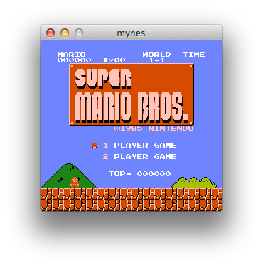

# mynes — Simple NES Emulator

## Controls

| Controller | Keyboard     |
|------------|--------------|
| ↑ ↓ ← →    | Arrow keys   |
| A          | <kbd>X</kbd> |
| B          | <kbd>Z</kbd> |
| SELECT     | <kbd>A</kbd> |
| START      | <kbd>S</kbd> |
