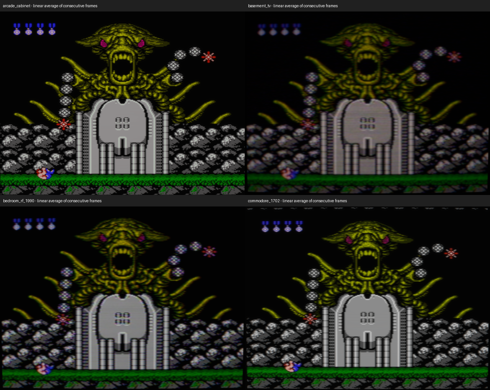
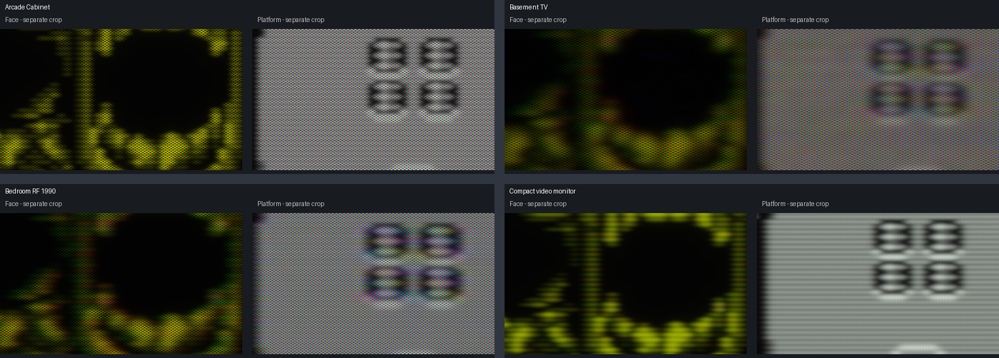
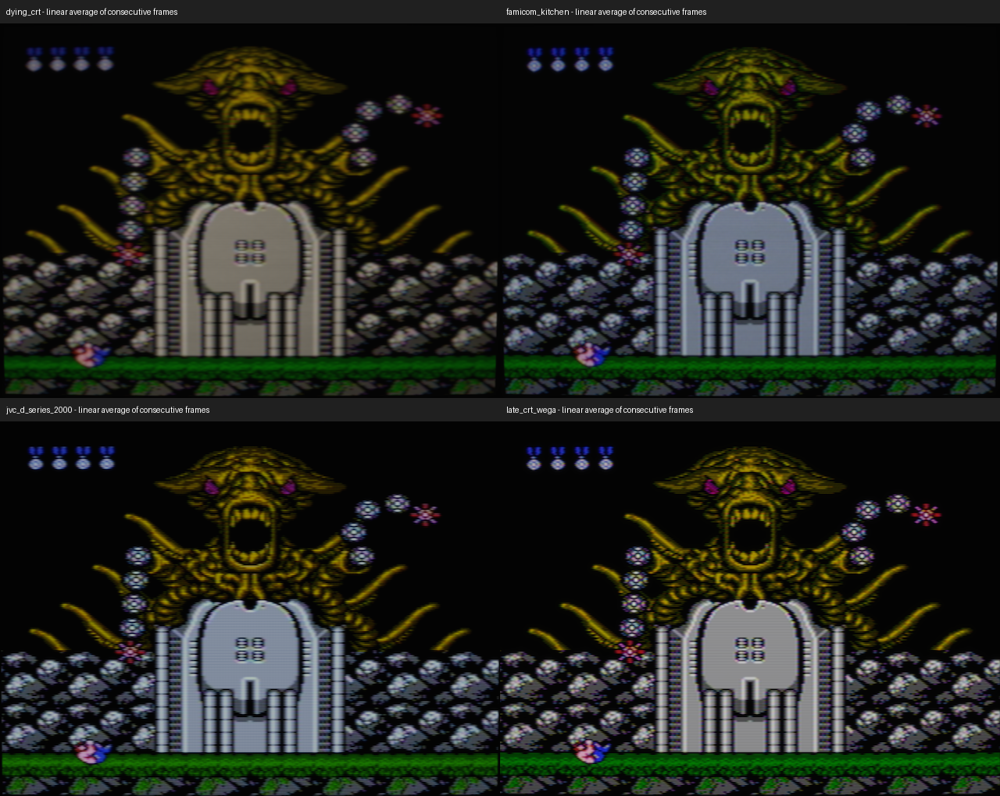
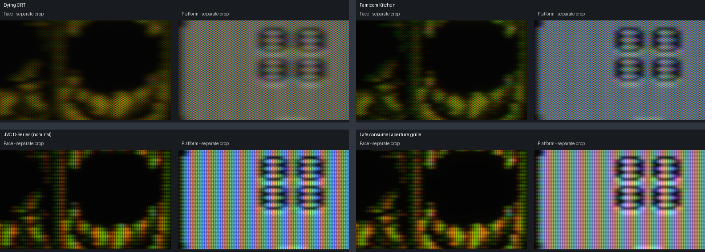
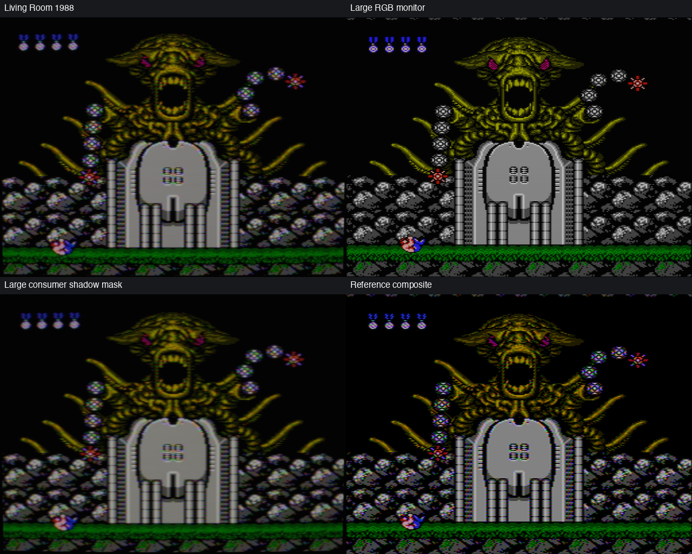
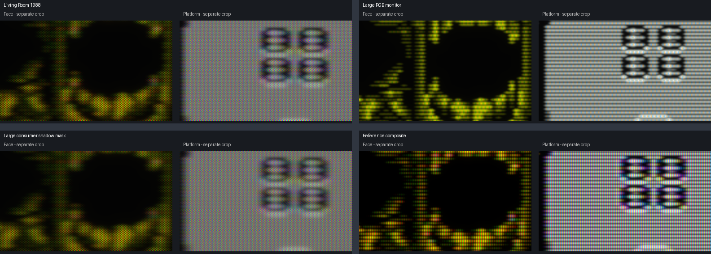
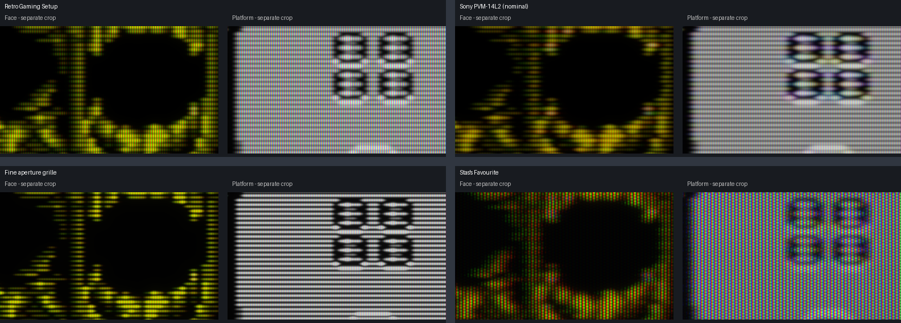
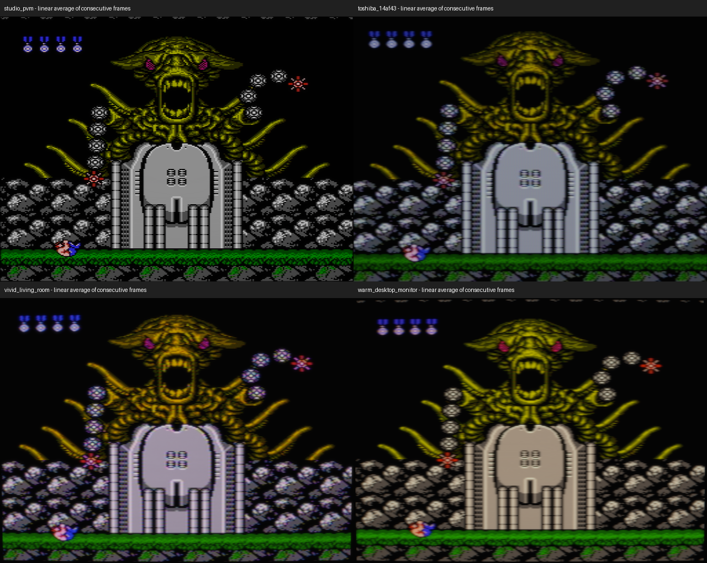
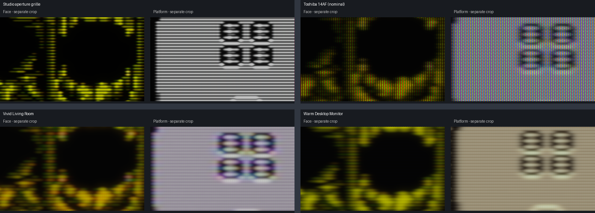

# Contra: all 20 CRT presets

For the current presentation, see the [game showcase](nes-visual-showcase.md) and [full-resolution gameplay / beam close-ups](gpu-beam-closeups.md). This page retains controlled diagnostic comparisons at their stated capture resolutions.

Actual output from the GPU renderer at commit `e02fc71`, captured offscreen at **2560×1920**. Every preset receives the same frozen 256×240 Contra boss PPU-code frame, with its own default connection and controls. Host mask alignment is Panel-pixels at 1:1 offscreen scale. This target is larger than the MacBook panel; it is a controlled 4:3 comparison, not a claim about fullscreen panel mapping.

Frames 60 and 61 are averaged in **linear light** before sRGB conversion, at a common 0.7 exposure to preserve more highlight detail in SDR. Full-resolution images are lossless WebP. Overview reductions are also made in linear light. The two-frame still average is a review exposure, not an extra emulator filter. These PNG/WebP previews do not reproduce live HDR headroom.

For unaveraged NTSC phases, see the [50 fps GIFs and 60.1 fps motion clips](gpu-motion-review.md).

## Assessment

**The four main profiles are the strongest way to present the project.** Sony is the focused monitor, JVC the firmer cool consumer set, Toshiba the softer household image, and Stas's Favourite the worn RF set. Mario's bright title screen confirms that the colour and focus differences survive outside the dark Contra scene.

There is still too much overlap in the wider library. Several old shadow-mask profiles are mainly variations of softness and tint; their coarse dot pattern can dominate at native size. The studio/Y/C group also contains near-neighbours. Dying CRT has stable geometry, but its severe blur sacrifices much of the artwork. Keep these as optional looks rather than presenting all twenty as equally convincing or individually measured televisions.

The renders have recognizable CRT structure, but a still cannot establish phosphor motion, flicker, time-varying RF noise, geometry breathing or audio synchronization. The supplied CRT photo also contains camera exposure, white-balance, lens and sampling effects; it is a useful qualitative reference, not a direct colour-calibration target. No rendering parameters were changed to make this gallery more flattering.

## Every preset

Each detail panel contains two separate crops: face on the left, platform on the right. Labels and a gutter separate these distant parts of the screen; they are not one contiguous image.

Click a preset name for the complete **2560×1920** render. View native crops at 100%: browser resizing can change fine mask appearance.

### Group 1



| Preset / connection | Visual assessment |
|---|---|
| [Arcade Cabinet](images/contra-gallery/arcade_cabinet.webp) · rgb | Clean source and broad beam distinguish it from the fine RGB monitor. Coarse delta dots dominate at close viewing; this is a generic arcade look, not a PlayChoice palette-ROM model. |
| [Basement TV](images/contra-gallery/basement_tv.webp) · rf | The darkest, muddiest RF image. Useful as a damaged-set extreme, but not a good default: face detail and highlight separation suffer. |
| [Bedroom RF 1990](images/contra-gallery/bedroom_rf_1990.webp) · rf | A more usable RF television than Basement: readable face and platform, with colour bleed and a coarse shadow mask. Overlaps the other household profiles. |
| [Compact video monitor](images/contra-gallery/commodore_1702.webp) · svideo | Clean Y/C edges with a softer desktop-monitor beam. More restrained whites than the warm personal variant; generic rather than Commodore-calibrated. |



### Group 2



| Preset / connection | Visual assessment |
|---|---|
| [Dying CRT](images/contra-gallery/dying_crt.webp) · composite | Stable raster and warm, weak-blue image, with severe loss of focus. The trapezoid is gone, but the blur still overwhelms fine artwork; a special effect rather than a showcase default. |
| [Famicom Kitchen](images/contra-gallery/famicom_kitchen.webp) · rf | Cooler household RF rendition. Its practical difference from Bedroom RF is modest in this scene; another candidate for library consolidation. |
| [JVC D-Series (nominal)](images/contra-gallery/jvc_d_series_2000.webp) · composite | A strong main profile: cooler platform whites, distinct beam structure and restrained composite colour edges. The slot grid is clear without the large shadow-dot pattern. |
| [Late consumer aperture grille](images/contra-gallery/late_crt_wega.webp) · composite | Balanced consumer sharpness and visible grille. Attractive, but overlaps JVC/PVM at overview size; not an independently calibrated WEGA. |



### Group 3



| Preset / connection | Visual assessment |
|---|---|
| [Living Room 1988](images/contra-gallery/living_room_1988.webp) · composite | Soft, warm household composite image. Broadly convincing from a distance, but coarse phosphor dots compete with the artwork close up. |
| [Large RGB monitor](images/contra-gallery/nec_xm29_arcade.webp) · rgb | Very clean RGB detail with narrow horizontal beam structure and fine mask. It can resemble raw pixels in a small thumbnail; native crops confirm the CRT stages are active. |
| [Large consumer shadow mask](images/contra-gallery/rca_colortrak_1986.webp) · composite | Broad beam and warmer consumer response. Visually close to Living Room 1988; limited additional identity in this scene. |
| [Reference composite](images/contra-gallery/reference_composite.webp) · composite | Sharp composite diagnostic look with visible colour breakup on fine patterns. Useful reference, less attractive as a television showcase. |



### Group 4


| Preset / connection | Visual assessment |
|---|---|
| [Retro Gaming Setup](images/contra-gallery/retro_gaming_setup.webp) · svideo | Bright, crisp Y/C picture with an aperture grille. A useful clean alternative, though it overlaps the studio group. |
| [Sony PVM-14L2 (nominal)](images/contra-gallery/sony_pvm_14l2.webp) · composite | The strongest focused-monitor reference here: separated scanlines, a fine vertical grille and readable white detail. Still cleaner and more regular than the supplied camera photograph; this is not proof of an exact 14L2 match. |
| [Fine aperture grille](images/contra-gallery/sony_pvm_20m4u.webp) · svideo | The thinnest-looking beam of the clean group. Strong scanline separation; more of an ideal high-resolution monitor than a small consumer TV. |
| [Stas's Favourite](images/contra-gallery/stass_favourite.webp) · rf | The most distinct worn-TV main profile: softer RF colour, visible convergence and a coarse slot structure. Rich character, but the mask is conspicuous at native size; static captures cannot assess whether its noise or load response moves convincingly. |



### Group 5



| Preset / connection | Visual assessment |
|---|---|
| [Studio aperture grille](images/contra-gallery/studio_pvm.webp) · svideo | Clean, high-resolution Y/C, closely related to Fine aperture grille. The two are difficult to justify as separate headline presets. |
| [Toshiba 14AF (nominal)](images/contra-gallery/toshiba_14af43.webp) · composite | A convincing softer alternative to JVC: wider highlights, stronger blending and a clearly visible slot mask. The grille/mask texture remains prominent in close-up. |
| [Vivid Living Room](images/contra-gallery/vivid_living_room.webp) · composite | Rich composite colour with a cooler/pinker platform than Warm Desktop. Stronger colour edging is visible around the small numerals; explicitly a personal preference. |
| [Warm Desktop Monitor](images/contra-gallery/warm_desktop_monitor.webp) · svideo | Warm whites and smooth Y/C detail give this a real distinction from the neutral compact monitor. The amber tint is intentional preference, not factory white-balance evidence. |



## A second scene


The flat sky makes cool/warm decoder response easier to compare. The title and bricks show Sony's sharper separation, JVC's firmer consumer focus, Toshiba's broader beam, and Stas's pronounced recovery/texture. These are frames 180/181 from the same ROM, with the same resolution and exposure as Contra.

## Reproduce

Use your own legally obtained game/PPU-code fixture; no commercial ROM or game-state binary is included here.

```sh
python3 frontends/gpu/tests/capture_patterns.py build/bin/mynes_gpu /tmp/contra-review \
  --all --frame 60 --size 2560x1920 --codes /path/to/contra-boss.bin
python3 frontends/gpu/tests/review_captures.py /tmp/contra-review --scene contra --exposure .7
```

The review script requires NumPy and Pillow. [Frame metrics](contra-gallery-metrics.json) record the phase difference, peak and average light for each preset. These metrics describe the capture; they are not a hardware-fidelity score. See the [preset audit](gpu-preset-audit.md), [hardware references](gpu-hardware-research.md) and [model limits](gpu-pipeline-reference.md).
