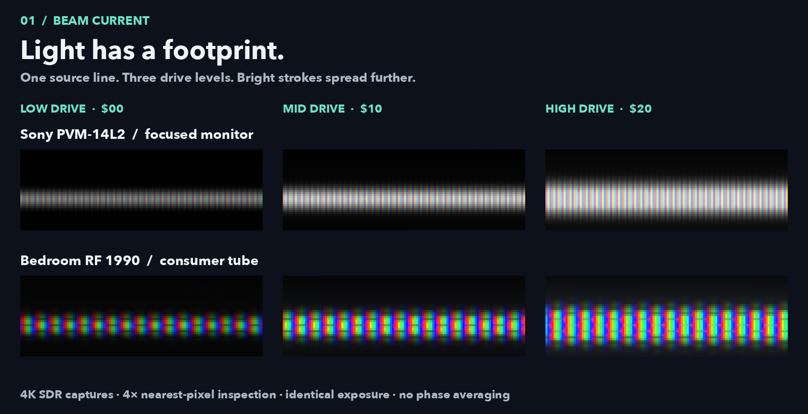
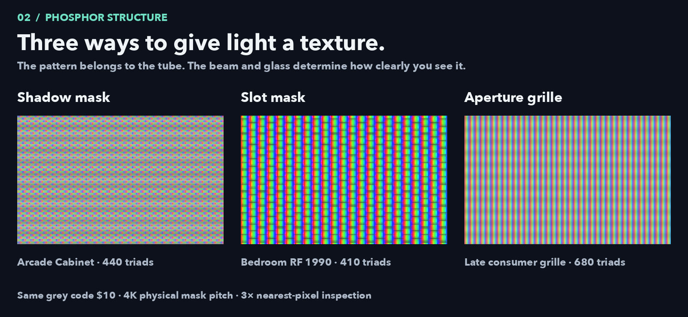
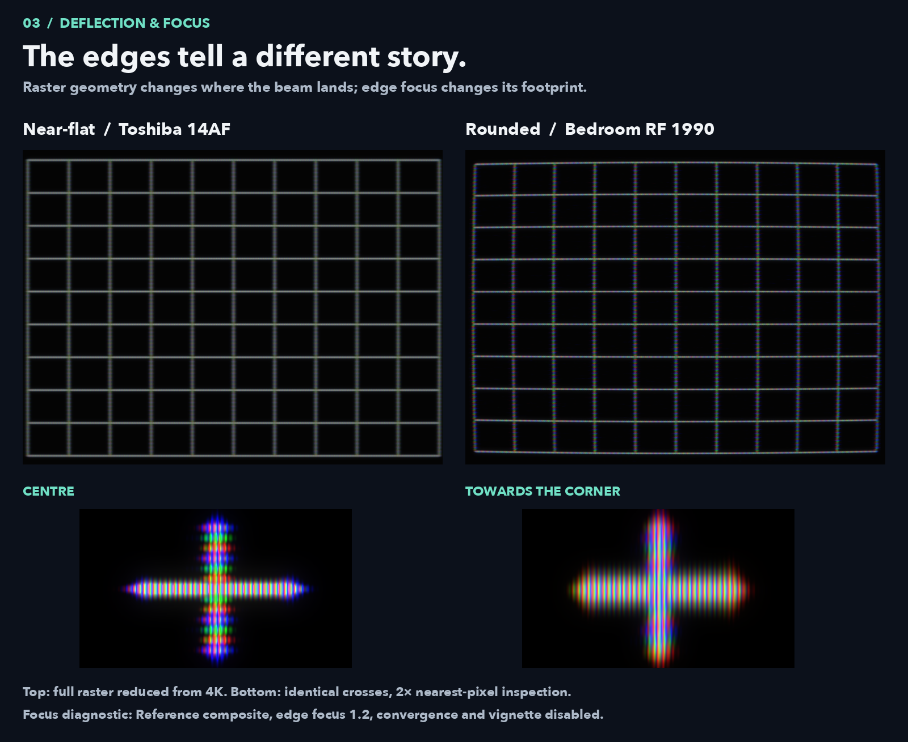
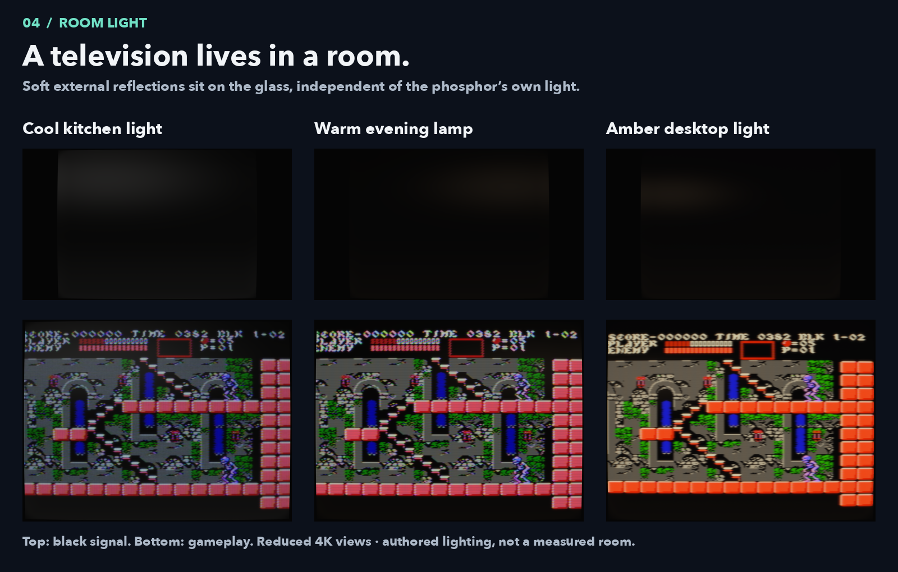
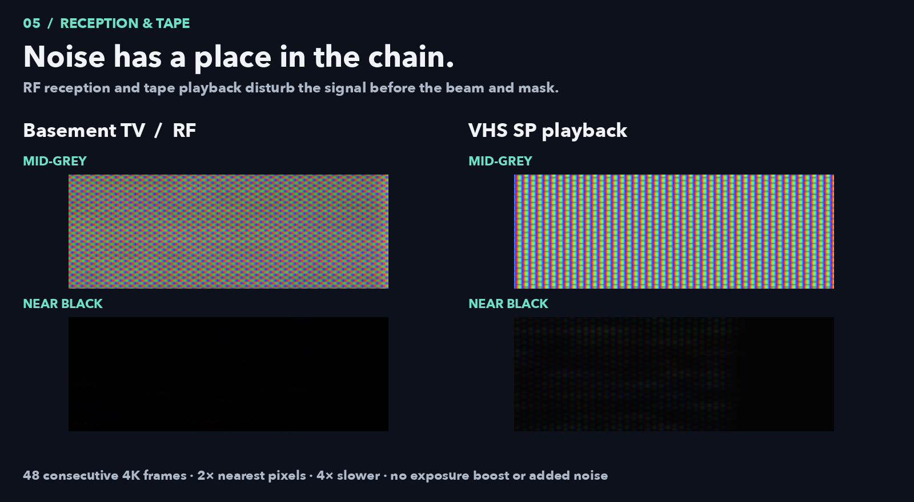

# Inside the glow

Five visual comparisons from the actual MyNES renderer. These are the same
panels presented in the [README](../README.md#inside-the-glow), with capture
notes here so the presentation stays readable.

## 1 · Beam current



The fixture draws the same one-line stroke at three NES grey codes: `$00`,
`$10`, `$20`. Both tubes receive the same input. The nominal PVM remains more
focused; Bedroom RF has a coarser, broader consumer footprint. Brightness
changes both emission and spot width. A wider beam does not remove the fixed
phosphor structure underneath it.

Each crop is 120×40 pixels from the 3840×2160 render, enlarged four times with
nearest-neighbour sampling. Exposure is unchanged across columns and rows.
They come from different horizontal positions in the same line, so the masks
and edge-focus state are not artificially aligned.

## 2 · Phosphor structure



Three shipped presets, all showing the same `$10` grey field. The dot lattice,
vertically slotted pattern and continuous grille differ at native resolution.
The three-times enlargement makes those differences legible on a README page.

The crops retain the full preset's colour, beam and mask response; this is not
an isolated mask-kernel comparison. A 4:3 picture within UHD is 2880 pixels
wide. Even at 4K, a 1200-triad grille has only 2.4 host pixels per triad—too few
to resolve every RGB stripe. Filtering that structure is intentional.

## 3 · Deflection and edge focus



The top pair uses the unmodified Toshiba and Bedroom presets on a common grid.
Curvature and overscan both contribute to their different outlines. These are
image-domain deflection models, not reconstructed glass radii.

The lower pair is explicitly a **diagnostic**, not a shipped preset or measured
tube. Reference composite has `edge_focus = 1.2`, zero convergence offsets and
zero vignette. Identical white crosses sit at source coordinates (128,120) and
(224,32). Equal-size crops are centred on their emitted light and enlarged two
times; neither is individually stretched, sharpened or exposure-normalized.
This shows the focus control separately from the subtler settings used in
normal presets. Composite colour remains in both crosses.

## 4 · Room light



The upper row uses normal NES black `$0f`; the lower row uses the same
Castlevania III BLK 1-02 framebuffer. Kitchen, Living Room and Warm Desktop now
have distinct soft reflections. The raster can go dark while room light still
falls on the glass. Internal light scatter/halation is a separate stage.

The upper row includes the complete UHD canvas. Gameplay is cropped to the
4:3 image for readability; both rows are reduced with Lanczos sampling.
These environments are authored moods, with approximate temperature tints and
broad procedural lights. They do not simulate a furnished room, surface-normal
reflections, bezel materials or absolute lux.

## 5 · RF and tape noise



Each side contains 48 consecutive frames from a 4K render of uniform grey and
normal black. The top patches cover output rectangle (2380,170)–(2660,270);
the bottom patches cover (600,170)–(880,270). Crops are doubled with nearest
pixels, without exposure lift, denoising, temporal averaging or added grain.
Playback is **67 ms per frame**, approximately four times slower than the
source's 60.1 Hz cadence. The loop jumps back after frame 77; it is an inspection
sequence, not a host-presentation or long transport-motion test.

RF noise enters reception, while tape luma grain, colour noise and transport
errors precede the television decoder. VHS now uses a slightly lifted receiver
operating point so shadow grain survives the gun response; reduced gain keeps
white close to the previous setting. This is an authored playback look, not a
claim that every VHS deck raises black to a fixed digital value. The audit
records the [before/after patch measurements](gpu-preset-audit.md#assessment-of-the-shared-engine).

[Static first frame](images/feature-tour/noise-still.png) ·
[Capture settings, fixture hashes and renderer fingerprints](images/feature-tour/sources.json)

## Reproduce

Build the GPU frontend first. Python needs Pillow and NumPy. The presentation
layout uses macOS's Avenir Next font; change `FONT` in the layout script when
using another system. The renderer writes real UHD screenshots; the scripts
only crop, arrange and label them.

```sh
python3 tools/review/audit_presets.py \
  --game-codes /path/to/256x240-palette-frame.raw --publish docs
python3 tools/review/feature_showcase.py
```

The game input is 61,440 bytes of NES palette codes. For the exact reviewed
scene, its SHA-256 is recorded in [the audit manifest](preset-audit-4k.json).
The synthetic fixtures need no ROM. By default full audit captures stay in
`/tmp/mynes-preset-audit-4k`, diagnostic captures and logs in
`/tmp/mynes-feature-showcase`, and the selected presentation assets in
`docs/images/feature-tour`. Captures use isolated user configuration, SDR,
physical mask pitch and no phase averaging. The feature tool checks input,
preset, executable and shader fingerprints before reusing a capture.

The [23-preset audit](gpu-preset-audit.md) covers backgrounds, beam, masks,
noise, optics, names and remaining limits. Spatial examples cannot establish
physical display luminance or prove flicker-free live presentation.
