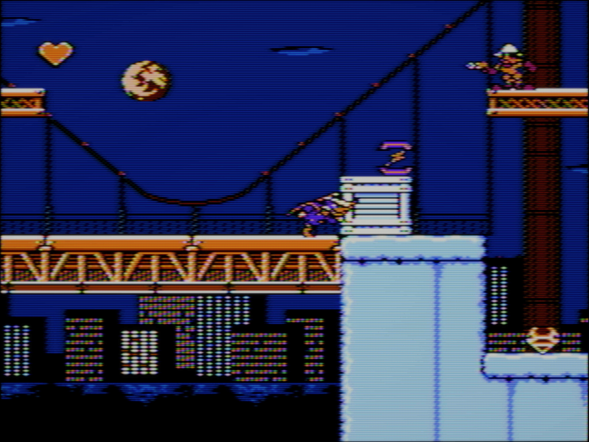
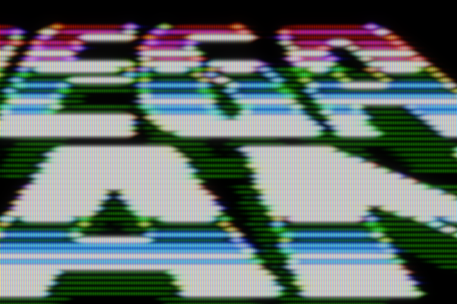
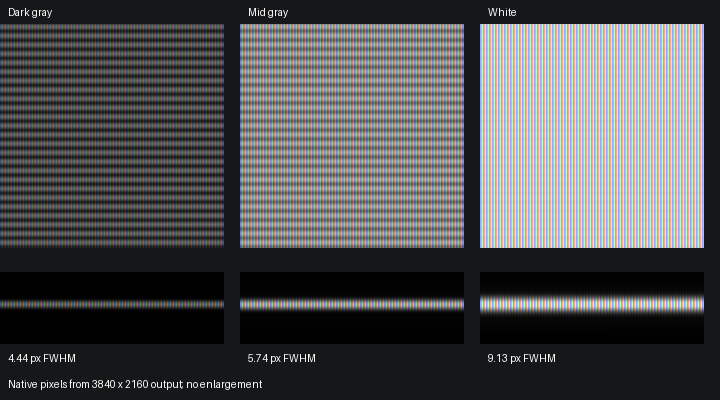

# Gameplay and beam height at native 4K pixels

The Darkwing gameplay capture is 3840×2880: the complete 4:3 game image is 3840 pixels wide, without side bars. The older comparison and controlled measurements below use 3840×2160 canvases with a 2880×2160 game viewport. Close-ups are cropped **without resizing**. Open the PNG at 100% to inspect the mask; fitting the image to a browser window can change its apparent pattern. They show one NTSC phase, not a blended exposure.

## PVM during gameplay

Open the full PNG at 100% for the actual output pixel scale. The in-page preview is reduced to fit the page. This is played game content, with the character, bridge rails, supports and city lights in the same frame. No test pattern or enlarged lower-resolution source is used.

[Native gameplay detail](images/showcase/4k/darkwing-pvm-gameplay-detail.png): a 1280×1152 crop at x=1600, y=1000, taken directly from the full image. It includes Darkwing, the dim blue sky, orange rails and the bright support. The bright support fills more of the scanline gaps; the blue background retains distinct narrow rows. The PVM remains visibly signal-softened at edges rather than looking like unfiltered RGB pixel art.

The beam buffer is 3840×2880 too. Pixel-aligned PVM mode rounds the nominal 3.59-pixel RGB-triad period to four pixels, giving 960 triads across the game. The nominal tube target is about 1070. That roughly 11% pitch difference is the disclosed alignment tradeoff; increasing capture size alone does not remove it. A native-pixel crop changes framing, not mask pitch relative to the game.

## The same Mega Man 2 title on four sets

The title combines dim green strokes, blue shading, bright lettering and fine edges. The rooftop adds intermediate grays. All four captures use emulated frame 900, after Start at frame 600, with the same 0.7 exposure and pixel-aligned mask mode.

| Preset | Native title detail | Full 4K image | Rooftop detail |
|---|---|---|---|
| Sony PVM-14L2 | [Beam and grille](images/showcase/4k/sony_pvm_14l2-beam.png) | [4K](images/showcase/4k/sony_pvm_14l2.png) | [Native crop](images/showcase/4k/sony_pvm_14l2-rooftop.png) |
| JVC D-Series | [Beam and slots](images/showcase/4k/jvc_d_series_2000-beam.png) | [4K](images/showcase/4k/jvc_d_series_2000.png) | [Native crop](images/showcase/4k/jvc_d_series_2000-rooftop.png) |
| Toshiba 14AF | [Beam and slots](images/showcase/4k/toshiba_14af43-beam.png) | [4K](images/showcase/4k/toshiba_14af43.png) | [Native crop](images/showcase/4k/toshiba_14af43-rooftop.png) |
| Stas's Favourite | [Beam and slots](images/showcase/4k/stass_favourite-beam.png) | [4K](images/showcase/4k/stass_favourite.png) | [Native crop](images/showcase/4k/stass_favourite-rooftop.png) |

The narrow dim strokes retain visible gaps. The white lettering spreads vertically and nearly fills those gaps. The Toshiba has softer outlines and a more prominent, coarser slot structure. These differences come from the preset's beam, mask and signal processing, not separate image-editing filters.

## Does the beam actually widen?

The top row shows equal-height patches; the lower row shows isolated one-source-line strokes. Source PPU codes are $00, $10 and $20 against $0F black. The samples above are native pixels from one frame. Measurements below use the mean of consecutive **linear-light** final captures, averaging 96 horizontal pixels at the centre of each stroke to suppress mask modulation. FWHM means the vertical width at half the peak luminance above the local background; it is measured before the 0.7 exposure and sRGB encoding used for the PNGs.

| Preset | Dark gray FWHM | Mid gray FWHM | White FWHM |
|---|---:|---:|---:|
| Sony PVM-14L2 | 4.44 px | 5.74 px | 9.13 px |
| JVC D-Series | 5.45 px | 6.93 px | 10.13 px |
| Toshiba 14AF | 6.64 px | 8.30 px | 12.68 px |
| Stas's Favourite | 5.83 px | 7.56 px | 10.34 px |

There are nominally nine output pixels per source scanline at this viewport height; geometry and overscan alter local spacing. These are final emitted-light widths, including focus, optics and output response. They are not the shader's input width parameters. RF and loading also change the drive, so a preset's maximum configured spot is not necessarily reached by this pattern. [Raw measurements](gpu-beam-measurements.json).

## Realism assessment and limits

The result is physically plausible in direction: brighter strokes widen and neighboring bright scanlines merge more than dim strokes. The shader uses each gun's current to change its pixel-integrated Gaussian spot, with shared focus/loading applied separately. It does not merely overlay fixed black scanlines.

It is **not a measured calibration of a PVM-14L2 beam**. Sony specifies a 0.25 mm aperture grille, 600 TVL horizontal resolution and other monitor properties, but does not specify these brightness-dependent vertical widths. TVL cannot establish beam height. [Sony specifications](https://www.sony.jp/pro-monitor/products/PVM-14L2/).

Real color-CRT focus evaluation involves both high- and low-intensity portions of the spot. Our Gaussian approximation and this FWHM measurement do not establish the correct tails, asymmetry or edge focus of an individual tube. [Hitachi beam-profile measurement](https://www.fujipress.jp/jrm/rb/robot000700030238/). A useful next calibration would photograph isolated gray/white lines on the user's 14L2 with fixed exposure and focus, with measured display settings and no clipped highlights.

The 4K image makes the PVM's fine grille much better resolved than a 960×720 capture. Pixel-aligned mode still quantizes the nominal pitch to a representable panel period; it does not claim to reproduce the physical grille pitch or LCD subpixel layout exactly. Still images also cannot reproduce CRT scanning and phosphor decay on a sample-and-hold LCD.
