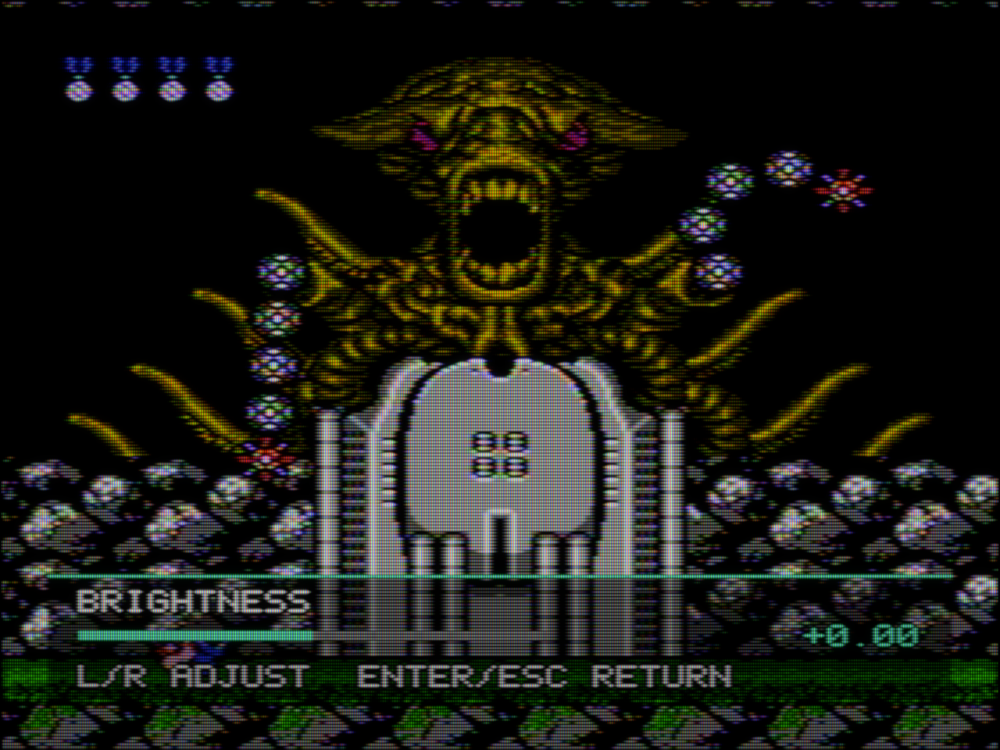

# GPU signal and CRT controls

## Controls

Two players share the keyboard, up to two gamepads hot-plug in the order they
arrive (first pad is player 1, second is player 2, a removed pad frees its
slot), and every developer key sits behind Ctrl so single letters stay free for
player 2.

| Input | Action |
|---|---|
| **Player 1 keyboard** | |
| Arrow keys | D-pad |
| X / Z | A / B |
| Tab / Return | Select / Start |
| **Player 2 keyboard** | |
| W / A / S / D | D-pad |
| J / H | A / B |
| U / Y | Select / Start |
| **Gamepad (P1 = first connected, P2 = second)** | |
| D-pad, left stick past half deflection | D-pad |
| EAST / SOUTH (Xbox B / A, PlayStation Circle / Cross) | A / B. NORTH is an alias of A, WEST of B. |
| BACK / START | Select / Start |
| GUIDE | Open or close the OSD menu |
| RIGHT SHOULDER (held) | Fast-forward, up to 8x |
| D-pad or stick while the menu or ROM browser is open | Navigate: SOUTH = Enter, EAST = Escape/back. A held direction repeats after 400 ms, then every 80 ms, like a held arrow key. Nothing reaches the game. |
| **Play hotkeys** | |
| Escape or M | Open the OSD menu; inside it Escape backs out (closing at the top) and M closes. Escape never quits during play. |
| Space, or **M → Game → Pause / Resume** | Pause / resume. The picture stays on screen with a PAUSED notice; audio continues cleanly on resume. |
| ` (backquote, held) | Fast-forward, up to 8x. Audio is muted while held and restarts cleanly on release. |
| F, Globe+F, F11 or Alt+Return, or **M → Host display → Native fullscreen** | Toggle fullscreen. With **Panel pixels** mask sampling it switches the panel to its native mode, so a scaled desktop setting does not resample the picture. macOS's own Space fullscreen (the green button) is turned off for the same reason. On a MacBook with a camera notch the picture fits below the camera housing, in the safe area macOS reports for the screen (the top 32 points); the band beside the notch stays black. |
| R, or **M → Reset console (R)** | Reset the console with its cartridge and RAM retained |
| G, or **M → Room reflections (G)** | Toggle simulated room reflections and glare |
| F5 / F7, or **M → Game → Save state / Load state** | Save to / load from the current state slot (see [Saves and save states](#saves-and-save-states)) |
| F6, or **M → Game → State slot** | Next state slot (1–4); the notice shows the slot in use |
| F12 | Screenshot of the final display pass to `/tmp/nes_screenshot_<frame>.ppm` (plus linear PFM) |
| P | Next CRT preset |
| O | ROM browser |
| C / Shift+C | Composite decode vs raw RGB / split view |
| V | Performance overlay |
| Ctrl+Q, or **M → Game → Quit** | Quit through the normal shutdown path |
| **Developer hotkeys** | |
| Ctrl+D | Dump per-stage pipeline buffers to /tmp |
| Ctrl+T | Cycle test signals (NES, colour bars, sine sweep) |
| Ctrl+B | Toggle temporal blend (dot-crawl cancel) |
| Ctrl+A | Switch CPU / GPU audio processing |
| Ctrl+L | Chain visualiser |

The frontend started without a ROM quits when the startup browser is
cancelled; that is the only Escape that exits.

Inside the menu, Up/Down chooses a row and Enter opens a submenu or enters
adjustment mode. On a parameter, Left/Right also starts adjustment
immediately. The menu then collapses to a bottom strip with only the
parameter, value and range bar; the rest of the game stays visible. Up/Down
moves to the previous/next setting while staying in adjustment mode. Enter or
Escape returns to the same row. A gamepad drives the same navigation.

Selecting another ROM in the browser initializes a fresh console and clears
the old picture history (and any pause) before playback resumes.

A `.nes` file opened from Finder (double-click or **Open With → MyNES** with
the app bundle) or dropped on the window loads the same way, with its battery
save and a place at the top of the recent list, and closes the browser or menu.
A file that does not load leaves the running game alone; the reason shows in
the browser when it is open, otherwise in an OPEN ROM FAILED notice.

Room reflections start **off** and the choice is saved as a host setting,
independent of the preset. Switching off retains each preset's light strengths
and leaves bloom/internal glass scatter intact. The same toggle is also in
**CRT / room → Glass / geometry** beside the glare controls. G shows the new
state in a notice for two seconds. In the menu the toggle's row shows the state;
its notice runs out behind the menu on the same two-second clock, so closing the
menu later shows no stale ROOM REFLECTIONS notice. While browsing ROMs, R and G
are search input, not global shortcuts.

For captures, `--room-reflections` and `--no-room-reflections` override the saved
choice for that run without changing it.

Region detection follows NES 2.0 timing metadata or the iNES PAL bit. Older
ROM dumps often leave the PAL bit unset: explicit `(E)`, `(Europe)`, `(PAL)`,
`(Australia)` and `(Europe, Australia)` filename tags supply a PAL fallback for
those legacy headers. Directory names do not affect detection, and NES 2.0
metadata takes precedence. The detected region applies to CPU/PPU timing, APU,
and the signal chain; loading a CRT preset retains the running console's region.

**M → Picture** puts the everyday TV controls first:

| Control | What it adjusts |
|---|---|
| Brightness | The picture's black-level offset. |
| Contrast | Signal gain, changing the difference between dark and bright areas. |
| Color (saturation) | Color intensity. |
| Tint (hue) | The decoder's color phase. |
| Sharpness | Edge peaking after luma separation; bypassed for RGB/direct. |
| Color temperature | The white balance, from warmer to cooler. |

Gamma, HDR emission gain and Room light follow these controls. The quick controls
share their values with the detailed signal/CRT menus and are included when
you use **Presets → Save current...**.

Sharpness cannot restore detail lost in the source/cable or narrow the tube's
beam spot. Its visible effect is deliberately limited by the rest of the chain;
Basement TV remains soft even at high settings. This is currently a generic
aperture-correction approximation, not each manufacturer's control curve.
See the [sharpening audit and hardware worklist](https://yaglo.github.io/mynes-web/research/sharpening/).

Audio starts in **GPU + fallback** mode. Use **M → Audio → Processing** or **Ctrl+A**
to switch to CPU processing for the session. `MYNES_GPU_AUDIO=0` selects CPU
at startup. A late GPU block falls back to CPU without delaying playback;
unavailable GPU audio also falls back automatically.



The menu and preset notice are mixed as RGB after the receiver, before the gun
amplifiers and beam. They retain the tube's focus, grille, geometry and light
response without acquiring NES composite rainbowing. Black text outlines keep
the translucent display readable over bright game content. The overlay pass is
skipped when closed; unchanged overlays reuse their uploaded pixels.


[Hardware evidence](https://yaglo.github.io/mynes-web/research/hardware/) · [Preset audit](https://yaglo.github.io/mynes-web/gallery/presets/)

Controls describe several different things: source electronics, receiver response,
CRT behavior, and adaptation to the host display. A working control is not by
itself evidence of a calibrated hardware model. The settings below have been
traced through the preset/OSD update paths to their consumers; this is not a
claim that every combination has been visually calibrated.

| Group | Controls and effect | Conditions and limitations |
|---|---|---|
| Source timing | Region, source phase, line phase, demodulation rotation | Gameplay frame phase comes from the PPU clock. Synthetic field advance/count are no longer offered in the OSD. Phase controls are diagnostics, not TV service adjustments. |
| Console | Output resistance, video bandwidth, differential-phase RC, PSU hum | Nonlinear phase response applies to NTSC composite/RF. Output resistance also affects the cable pole. |
| Cable | Length, resistance, capacitance, termination, shielding, reflection level/delay | A lumped pole and explicit delayed reflection, not a distributed transmission line. Reflection delay needs nonzero reflection level. Shield pickup is a generic noise approximation. |
| RF | Carrier level, noise floor, complex IF bandwidth/asymmetry/detuning, AGC attack/release | Applies to the RF route. Carrier *frequency* is legacy channel metadata, not a simulated tunable RF oscillator. |
| Y/C separation | Horizontal trap, line-comb topology, comb extraction fraction | Trap reduces cross-luma; it cannot remove luma leaking into C. Comb fraction zero selects a legacy default, not bypass. NTSC line combs do not operate on PAL or separated-input routes. |
| Decoder filters | Y/I/Q bandwidth, FIR lengths/window, sharpness | Q bandwidth zero follows I. Short luma FIRs below 23 taps disable the trap. FIR lengths are session diagnostics rather than saved tube characteristics. |
| Color | Hue, saturation, decoder R-Y/B-Y gain, white point, RGB drive/cutoff, phosphor primaries | Decoder gain differs from white balance. Primaries are nominal colorimetric matrices, not measured spectra of each preset's tube. |
| Video amplifier | RGB bandwidth, rise/fall asymmetry, vertical smear, edge derivative | Equivalent filtering and behavioral effects; not circuit models of the named monitors. Edge derivative retains the legacy JSON key `velocity_mod`, but is a voltage offset, not physical scan-velocity modulation. |
| Gun and spot | Gamma and per-gun offsets, dark/white FWHM, bloom exponent, horizontal spot size/growth, edge focus, convergence | Positive FWHM settings override the old sharpness/height fields. RGB landing offsets precede the mask. |
| Loading | Video rail sag, black-level recovery, recovery time, size sag, focus change | Strength zero disables the corresponding effect. Recovery time matters only with recovery enabled. Supply models are generic. |
| Geometry | Position, size, curvature, skew, rotation, keystone, jitter, interference jitter, wobble, top-band faults | Top-band bounds need shift/skew enabled. “Interference jitter” is a geometry disturbance, not an RF carrier simulation. |
| Mask | Type, triads across, pixel pitch, strength, RGB/BGR order | Positive triad count overrides pixel pitch. Pitch is derived from the actual drawable, filtered when unresolved, and optionally aligned to pixels. RGB/BGR denotes modeled phosphor order, not proof of physical panel-subpixel alignment. |
| Time | Persistence and RGB lifetime scales, optional frame blend and motion threshold | Motion threshold only affects frame blending. This post-render blend is not a 3D composite comb filter. Zero persistence disables phosphor history. |
| Tube variation | Cathode gains/nonuniformity, purity tint, grain, thermal doming, chromaticity shift, astigmatism, microphonics | Behavioral approximations, not individually measured tube defects. Avoid increasing every imperfection merely to make a picture “more CRT.” |
| Glass/room | Halation and tint, glass transmission/reflection, scatter, antiglare, glare position/size/color, ambient light, vignette | Halo tint sets per-primary scatter fractions and needs halation. Internal reflection uses spatial scatter, not a local gray pedestal. Glare geometry and ambient light require Room reflections (G) enabled. Reflected room light does not scale with emission gain. |
| Output | HDR emission gain, available HDR headroom, SDR white level | Gain controls emitted light in HDR output only (SDR uses 1); headroom and white level come from the host. The output shoulder preserves RGB ratios while fitting peaks. |
| Audio | Amplifier drive, hum strength/frequency/harmonics, noise | Shared CPU/GPU audio model controls; independent of picture gain. |

Legacy `num_sections` and RF `carrier_freq` values still round-trip when importing
old presets, but are not operative GPU controls. They are retained for file
compatibility, not exposed as adjustable hardware capabilities. Other conditional
legacy fields remain readable so older custom presets retain their interpretation.

## Saves and save states

Battery-backed cartridge RAM and save states live next to `config.json` in
the config directory (`$XDG_CONFIG_HOME/mynes`, else `~/.config/mynes`, else
`~/.mynes`):

| File | Contents |
|---|---|
| `saves/<name>.sav` | The 8 KB PRG RAM window (`$6000-$7FFF`) of a cartridge whose iNES header sets the battery bit |
| `states/<name>.s1` … `states/<name>.s4` | Save-state slots 1–4 |

`<name>` is the ROM file's name without its extension followed by the ROM's
CRC-32 (PRG then CHR), for example `Zelda (U)-9e7f1a3c`. Two dumps that share
a file name therefore never share a save, and renaming a ROM keeps its files
findable by the CRC in their names.

**Battery RAM** is restored when a cartridge with the battery bit loads, from
the command line or the ROM browser, and written back whenever it has changed:
about every two seconds during play, before another ROM loads, and on quit.
**M → Game → Write battery save now** forces a write. Files are replaced
atomically (written to a `.tmp` file and renamed), so an interrupted write
keeps the previous save. Cartridges without the battery bit never create a
file. Console reset (R) keeps the RAM, so resetting loses nothing.

**Save states** capture the whole machine: CPU, PPU (VRAM, OAM, palette),
APU, mapper registers, work RAM, PRG RAM, CHR RAM and the master clock, so a
loaded state resumes cycle-exact. F5 saves to the current slot, F7 loads it
and F6 selects the next slot; **M → Game** offers the same as State slot,
Save state and Load state. Loading unpauses, resets the picture history and
the CRT's temporal state (phosphor persistence, supply sag) so the restored
picture does not blend with the one it replaces, and restarts audio cleanly.
The first picture shown after a load is the first frame run from the state.
A load that fails leaves the running game untouched and says why, in a notice
and on stderr: an empty slot, a state from another ROM (CRC or mapper
mismatch), a different region, a corrupted file, or a state written by a
different MyNES build. States are deliberately not portable between builds:
the file embeds the core's state layout, checked by size, and the format
version changes when the layout changes on purpose.

Not saved: the CRT preset and its temporal state, queued audio, controller
mappings and other host settings. A state includes the PRG RAM it was taken
with, so loading one rewinds battery-backed progress along with the rest of
the machine, and the periodic write then stores that older RAM.

Limitations: MMC5 is emulated with one 8 KB PRG RAM bank at `$6000-$7FFF`;
banked PRG RAM beyond that is not emulated, and ExRAM is not part of the
`.sav` file (it is part of a save state). Mapper 227 multicarts have no PRG
RAM. The SDL2 frontend restores and writes battery RAM the same way but has
no save-state keys.

## Recording clips

`--record OUT` turns a hidden playback run into a video file: one video frame
per emulated frame, with the APU audio of exactly those frames. It needs
`--offscreen WxH` (every frame is the final display target, mask and glass
included, read back the way `--screenshot-after` captures it: 8-bit from an
SDR target, RGBA16F from an EDR target and with `--record-hdr`) and
`--record-seconds N`. `--sdr` keeps the target 8-bit sRGB like the file; an
EDR target is tone-mapped the way the PPM screenshot is. `--record-hdr` keeps
the EDR highlights instead and records BT.2020 PQ (see
[HDR recordings](#hdr-recordings)).

```
mynes_gpu --offscreen 1920x1440 --sdr --preset presets/sony_pvm_14l2.json \
    --load-state ~/.config/mynes/states/Contra-3ec0cad1.s1 \
    --input-replay clip.input --record contra.mov --record-seconds 12 contra.nes
```

| Flag | Meaning |
|---|---|
| `--record OUT` | Output path; the container follows the extension, `.mov` or `.mp4`. Requires `--offscreen`. |
| `--record-seconds N` | Clip length. Frames = round(N × rate) with the region's exact rate, 60.0988 (NTSC) or 50.007 (PAL), which is also the stream's frame rate. |
| `--record-after F` | Emulated frames run before the first recorded one (default 2), so a loaded state's first pictures are left out. |
| `--record-hdr` | Record BT.2020 PQ from a half-float target instead of 8-bit sRGB. Requires `--record`; not with `--sdr`. |
| `--record-headroom H` | Headroom over SDR white for the recorded render, 1 to 10000. Requires `--record`; not with `--sdr`, whose target has none. Without the flag the render uses `MYNES_OFFSCREEN_HEADROOM` when it is set, otherwise 1.6, or 4.0 with `--record-hdr`. |
| `--record-hdr-white NITS` | Luminance of SDR white (1.0) in an HDR recording, default 203 (ITU-R BT.2408). Requires `--record-hdr`. Headroom × white must stay within the 10000-nit PQ peak. |
| `--load-state FILE` | Load a save-state file once the ROM is running, before the first frame. Useful outside recording too. It is the F7 load path: the picture history, audio and the CRT's temporal state restart, and a rejected file (wrong ROM, region or build) stops the run with the loader's reason. |
| `--input-replay FILE` | Scripted player-1 input for the run; see below. |

The playback worker produces one picture at a time and waits until the
renderer has taken it (the backpressure `--screenshot-pair` uses), so nothing
is dropped or duplicated however slow the render is; the emulation itself
still runs in real time, so a clip takes at least its own length to record.
Each final frame is read back and piped as rawvideo into an `ffmpeg` child,
rgb24 or, with `--record-hdr`, 16-bit PQ Y'CbCr (yuv444p16le). The child
encodes it beside the output (`OUT.video.<ext>`), while the worker writes the
same frames' audio as float32 mono 44100 Hz (`OUT.audio.f32le`). When the
frame count is reached, a second `ffmpeg` run muxes both into OUT with AAC at
256 kb/s, cut at the video's length, and the temporary files are removed.
Progress is printed every 60 frames and a final line gives the frame count,
seconds and path. Any ffmpeg failure exits non-zero and prints the tail of
ffmpeg's messages.

`ffmpeg` is taken from `MYNES_FFMPEG` or found on `PATH`. The video codec
arguments default to a portable near-lossless master:

```
-c:v libx264 -preset veryfast -crf 12 -pix_fmt yuv444p
```

`MYNES_RECORD_CODEC_ARGS` replaces that whole string (split on whitespace).
On a Mac the hardware encoder is much faster and the result plays anywhere:

```
MYNES_RECORD_CODEC_ARGS="-c:v h264_videotoolbox -b:v 90M -pix_fmt yuv420p"
```

The exact commands, for reference (WxH is the offscreen size, the rate is the
region's):

```
ffmpeg -y -loglevel error -f rawvideo -pix_fmt rgb24 -video_size WxH -r 60.0988 -i - <codec args> -an OUT.video.mov
ffmpeg -y -nostdin -loglevel error -i OUT.video.mov -f f32le -ar 44100 -ac 1 -i OUT.audio.f32le -c:v copy -c:a aac -b:a 256k -t <frames / rate> -movflags +faststart OUT
```

`-t` is the clip's exact length (1.996712 for 120 NTSC frames). The muxed
AAC track ends 0.7 ms before the video, so `-shortest` in its place drops
the last one to four video frames.

After the mux the recorder writes `OUT.json` beside the clip (`contra.mov`
gives `contra.json`). A recording deletes an older `OUT.json` when it
starts, so the file only ever sits beside a clip whose recording finished:

```json
{
  "frames": 721,
  "rate": 60.0988,
  "width": 1920,
  "height": 1440,
  "hdr": false,
  "white_nits": 100,
  "headroom": 1
}
```

`headroom` is what the CRT shader rendered with: 1 on an SDR target (with
`--sdr`, or where the hidden window's swapchain offers no HDR format, as on
some Vulkan systems), otherwise the offscreen headroom, whose highlights the
SDR file clips at white.
`white_nits` of an SDR clip is the BT.709 studio reference of 100 nits; the
file itself is display-relative. An HDR clip adds `max_cll` and `max_fall`.

### HDR recordings

```
mynes_gpu --offscreen 1920x1440 --record-hdr --preset presets/sony_pvm_14l2.json \
    --record smb-hdr.mov --record-seconds 2 "Super Mario Bros (JU) (PRG 0).nes"
```

With `--record-hdr` the hidden target is RGBA16F whatever the window's
swapchain offers. It holds extended-linear light with BT.709 primaries (on
macOS the extended linear sRGB of an EDR layer): 1.0 is SDR white,
highlights run above it up to the headroom, and colours outside BT.709 have
small negative components. Measured on a 1920x1440 Sony PVM-14L2 render of
Super Mario Bros.: below the output shoulder the values match the `--sdr`
render within 8-bit rounding and do not change with the headroom; the
largest component was 1.54 at headroom 1.6 and 3.33 at 4.0, and reds had
blue components down to -0.0056.

Each frame is converted on the CPU. A 65536-entry table turns the half
floats into floats. The ITU-R BT.2087 matrix takes BT.709 primaries to
BT.2020, and negative components are clamped to 0 after it: in the frame
above, 392,000 pixels had a negative BT.709 component and none was negative
in BT.2020. Values are scaled to nits (1.0 = `--record-hdr-white`), clamped
at 10000 and encoded with SMPTE ST 2084 through a table indexed by the
float's exponent and top mantissa bits, within 1e-6 of the exact curve. The
BT.2020 non-constant-luminance matrix then gives Y'CbCr, stored as
limited-range 16-bit codes in three planes (yuv444p16le): 64 times the
10-bit codes, so Y' runs from 4096 to 60160 and Cb and Cr from 4096 to
61440. Large frames are split into row bands across up to eight threads. At
3840x2880 on an M5 with other renders running (load average 16 to 25), one
thread took 60 to 140 ms per frame and eight took 10 to 21 ms in a
standalone benchmark. In a 2-second recording, where the frame is read from
the GPU download buffer while ffmpeg encodes, the final log line reported 18
ms per frame; it gives that average for every HDR recording.

ffmpeg reads the frames as yuv444p16le rawvideo tagged `bt2020`,
`smpte2084`, `bt2020nc` and `tv`, reduces the samples to the codec's depth
with no colour conversion and tags the stream the same way. The recorder
does the Y'CbCr step itself because ffmpeg's own, from rgb48le through
`scale=out_color_matrix=bt2020:out_range=tv`, scales the limited-range
excursions by 257/256 in ffmpeg 9.0.2: PQ 1.0 was stored as Y' 943 of 10
bits in place of 940, and every level decoded about 2% too bright. The input
tags are needed: ProRes and the `.mov` `colr` atom take primaries and
transfer from the frames, and with output tags alone ffprobe reports both as
unknown. The default master is ProRes 4444, 10-bit 4:4:4, and needs a `.mov`
output:

```
-c:v prores_ks -profile:v 4 -pix_fmt yuv444p10le -vendor apl0
```

`MYNES_RECORD_HDR_CODEC_ARGS` replaces that string and must choose a 10-bit
or deeper pixel format. HDR recordings ignore `MYNES_RECORD_CODEC_ARGS`: a
typical SDR override such as 8-bit 4:2:0 H.264 would carry PQ with visible
banding. The colour tags stay around whatever codec arguments are given; a
4:2:0 format such as p010le only subsamples the chroma. The hardware HEVC
encoder, for example, writes Main 10 with the same tags and codes:

```
MYNES_RECORD_HDR_CODEC_ARGS="-c:v hevc_videotoolbox -profile:v main10 -pix_fmt p010le -b:v 120M -tag:v hvc1"
```

The encode command (the mux is the same as for SDR; stream copy keeps the
tags):

```
ffmpeg -y -loglevel error -f rawvideo -pix_fmt yuv444p16le -video_size WxH -r 60.0988 -color_primaries bt2020 -color_trc smpte2084 -colorspace bt2020nc -color_range tv -i - <codec args> -color_primaries bt2020 -color_trc smpte2084 -colorspace bt2020nc -color_range tv -an OUT.video.mov
```

ffprobe lists a ProRes 4444 stream as `yuv444p12le`, the decoder's format,
although the encoder was given 10-bit samples.

`OUT.json` of the clip above:

```json
{
  "frames": 120,
  "rate": 60.0988,
  "width": 1920,
  "height": 1440,
  "hdr": true,
  "white_nits": 203,
  "headroom": 4,
  "max_cll": 617,
  "max_fall": 223
}
```

`max_cll` and `max_fall` are the CTA-861.3 content light levels in whole
nits: the brightest pixel and the brightest frame average over the clip,
each pixel measured by its largest BT.2020 component after the 10000-nit
clamp. The `.mov` carries no HDR10 metadata of its own; an HEVC or AV1
encode of the master takes these values (x265 `max-cll`).

### Scripted and recorded input

`--input-replay FILE` reads the [review replay format](../tools/review/README.md):
rows of an emulated frame number and a hexadecimal player-1 mask (A=01, B=02,
Select=04, Start=08, Up=10, Down=20, Left=40, Right=80), each held until the
next row, strictly ascending, at most 128 rows. With `--record`, frame numbers
count from the first recorded frame: row `1 08` presses Start on the first
frame of the clip whatever `--record-after` is. Without `--record` they count
from the first emulated frame, like `MYNES_REVIEW_INPUT_SCRIPT`.

`--input-record FILE` writes that format during ordinary windowed play: a row
whenever the player-1 mask changes, numbered from the frame after the most
recent console start, reset (R) or state load (F7), so the file replays from
that same point; a reset or load starts the file over. A change pressed and
released within one frame is not written, rows are flushed as they are
written, and the file is closed at exit. The workflow for a clip:

1. Play to the start of the clip and press F5. The state file is
   `states/<name>.s<slot>` under the config directory (see above).
2. Run again with `--load-state <that file> --input-record clip.input` and
   play the clip.
3. Render it: `--offscreen WxH --sdr --load-state <that file> --input-replay
   clip.input --record clip.mov --record-seconds N`. Use `--record-after 0`
   for the rows to land on the frames they were recorded on; with the
   default of 2 they play two frames later.

Recorded rows carry a human's timing, including the usual frame of input
latency, and the loader accepts at most 128 rows, so trim a long session.

## Grille and HDR

The mask is normalized in linear light: its dark gaps concentrate the average
emission into brighter phosphor regions. HDR provides room for those peaks;
it does not create extra physical subpixels or recover detail below the panel's
resolution. At insufficient headroom, the output shoulder reduces resolved
phosphor peaks, lowering mean brightness. Increasing gain indefinitely then
compresses highlights instead of restoring an unbounded glow.

The decoder preserves superwhite and undershoot as voltage through the video
amplifier; gun cutoff and supply loading precede emission. Nominal white is not
treated as an amplifier rail. Exact amplifier saturation remains uncalibrated.
The final shoulder scales the entire linear RGB vector instead of clipping
channels independently. Extended-linear HDR also retains negative sRGB
coordinates introduced by the phosphor-primary conversion, allowing the host
colour manager to reproduce colours outside sRGB on capable panels. SDR reduces
out-of-gamut chroma towards an equal-luminance neutral before output encoding.
Available headroom and SDR white are queried from the window each frame.

An actual GPU render-target test uses a uniform 0.25 linear input and emission
gain 2. For the aperture grille, measured red-channel means and maximum RGB
peaks are:

| RGB period in drawable pixels | SDR mean / peak | Headroom 4 mean / peak |
|---|---:|---:|
| 3 | 0.4824 / 0.8271 | 0.5000 / 0.8618 |
| 6 | 0.4249 / 0.9072 | 0.4998 / 1.1748 |
| 12 | 0.3580 / 0.9434 | 0.4998 / 1.6035 |

These are linear framebuffer measurements, not nits measured on a MacBook.
Regression tests also check RGB balance, unresolved-mask averaging, ambient
independence, highlight slopes and output limits. Real panel peak brightness,
local dimming, viewing distance and ambient reflections remain external factors.

An additional before/after Contra check used unaveraged 3840×2880 phase pairs,
unchanged presets and a simulated headroom of 4. Removing the decoder's early
0–1 clamp produced these maximum linear RGB components:

| Preset | Before | After | Mean scene luminance change |
|---|---:|---:|---:|
| Sony PVM-14L2 | 1.720 | 2.920 | +0.31% |
| JVC D-Series | 3.338 | 3.742 | +0.51% |
| Toshiba 14AF43 | 3.236 | 3.631 | +0.26% |
| Stas's Favourite | 3.313 | 3.502 | +0.31% |

These are isolated highlight changes, not an increase to preset gain. All four
also stayed within a simulated 1.6 headroom. Fixed-exposure SDR previews were
inspected at native crop resolution; they cannot demonstrate actual HDR glow.
The companion PFM capture preserves signed HDR values; PPM clips to SDR white.

## High-refresh presentation

**Host display → Presentation → 60 Hz hold** is the default and targets picture presentation at
60 per second, without dark-frame insertion (`--presentation 60hz`). Each picture
remains visible until its replacement. This is a session preference, independent
of CRT presets. **Hold** uses the native source rate, except when locking to a
panel within 0.5% of that rate (for example NTSC on a 60 Hz MacBook Air).
Neither option freezes or averages the composite carrier phase.

On a matching fixed-refresh panel, both hold modes use ordinary vsync with one
frame allowed in flight. The emulation worker follows the panel rate and waits
when its picture queue is full (one picture with **Low latency** on, three with
it off; see [Performance](#performance)), preserving consecutive composite phases.
There is no second CPU or Metal presentation deadline racing against vblank.
The small wall-clock speed adjustment is compensated in audio resampling;
emulated CPU/APU/PPU cycle ratios are unchanged. A sustained rendering stall
can still cause audio starvation, but cannot silently discard queued phases.

For unmatched rates, the bundled Metal backend retains timed presentation with
two source intervals of lead and automatic recovery after stalls. Other
backends and offscreen reviews use CPU pacing for 60 Hz hold. PAL remains about
50 frames/s on a 60 Hz panel, which necessarily produces uneven frame repeats.
The option does not change the monitor's refresh rate: a fixed 144 Hz panel
also cannot show 60 evenly spaced updates without a matching display mode or
variable refresh.

The serrated colored edges in composite video are consistent with cross-luma
(dot crawl): see the [AD723 encoder datasheet](https://www.analog.com/media/en/technical-documentation/data-sheets/AD723.pdf).
Irregularly holding or skipping phases can turn that regular pattern into
intermittent shimmer. `MYNES_PRESENT_TRACE=/tmp/presentation.csv` records each
submission's source frame, carrier phase, presentation mode and refresh slot.
This helps distinguish missed pictures from normal phase changes; submission
timestamps alone cannot establish what the panel actually displayed.
With **Low latency** off, the playback handoff retains three consecutive
pictures rather than replacing an unread picture immediately. This absorbs
brief scheduling jitter without discarding alternating carrier phases.
Sustained overload still drops the oldest picture; emulation and audio never
wait for the renderer. With it on (the default), a free-running renderer takes
the newest picture instead and a display-paced one holds the worker at a
single queued picture.
The bundled Metal backend also supports `MYNES_METAL_PRESENT_TRACE=1`, which
logs actual drawable presentation timestamps, deadlines and source frames.
`frontends/gpu/tests/test_metal_presentation.py` runs a windowed composite/GPU
audio review and reports visible intervals. Keep its window visible; a zero
Metal presentation timestamp is not a successful displayed frame.

Host display → Presentation → BFI enables optional dark-frame insertion.
Dark refresh defaults to 0.15, so switching to BFI gives each dark refresh 15%
of its paired bright refresh's phosphor light. Override it with
`--dark-frame-level F` (0–1); 0 gives fully black refreshes.
This is linear-light dimming, not
window transparency. The preference is session-only
and deliberately absent from television presets.

The current display must report approximately 2–8 refreshes per source frame:
120/240 Hz for NTSC, 100/200 Hz for PAL, for example. 60 Hz, unknown refresh and
144/60 combinations use Hold. The OSD shows when BFI is inactive. If submission
cadence falls below 85% of the reported rate over 60 intervals, BFI suspends;
toggle it off/on after resolving the cause. Moving to another display or
changing its reported mode restarts the check. Submission times can detect
slow pacing but cannot certify physical scanout, especially under variable
refresh/compositing.

Only the first refresh runs the NES signal/beam pipeline. Additional refreshes
reuse its output and glass-scatter textures; the final phosphor/glass pass runs
again. Audio, PPU timing, carrier phase, phosphor history and supply state advance
once per emulated frame. Blank/dim refreshes affect emission (including its
pedestal), not room reflections. Bright-refresh gain compensates the duty cycle
before the HDR shoulder; insufficient peak headroom still reduces average
brightness. BFI and a strong grille compete for the same available headroom.

This reduces display hold time when the host presents the requested cadence;
it is **not a simulation of a continuously moving CRT beam**. At 120 Hz a lit
refresh still lasts about 8.3 ms, with the LCD's own response on top. A rolling
exposure model would need source history and time-integrated phosphor decay;
a black horizontal band alone would not reproduce that behavior.

`MYNES_PRESENT_TRACE=/tmp/presents.csv` records every submission with source
frame number, refresh slot and reported display Hz. Ordinary playback traces
continue to count source pictures only. Offscreen captures use Hold, so a still
capture remains comparable across machines.

Validation: CPU tests cover rate eligibility and pulse-energy integration;
actual HDR render-target tests verify emitted-light integration and unchanged
ambient margins. The local 60 Hz desktop correctly remained in Hold (~60.10 submissions/s).
A user test on a 120 Hz MacBook reported improved motion. Its captured trace
contains a continuous 126.77-second BFI segment at 119.78 submissions/s; the last
1,000 submissions average 120.02/s. Bright/dim slots share the same source frame.
These are submission measurements and subjective viewing, not photodiode or
high-speed-camera validation of physical scanout.

`black_floor` is minimum gun drive, applied before transfer and spot deposition.
It preserves scanline structure in residual emission; use ambient light for a
room-lit glass pedestal. Raising black floor does not illuminate blanked raster.


## Subpixel lab

**M → Host display → Subpixel lab** draws one half of the picture again
with a variant of the grille, at the same gain, so the two can be judged
side by side on the panel itself. Split picks the half (Off, Right half,
Left half). Gap share R, G and B move that share of a colour's light half
a triad along, onto the same colour's subpixel in the other pixel of a
two-pixel triad; 0.5 spreads it evenly, 0 is the plain grille. Gain R, G
and B trim each output channel. Stripe fill is the phosphor stripe's share
of the triad (0.28 is the shipped value). The values are saved to
`config.json` as `gpu_lab_*` in hundredths. They apply only to the lab
half; the shipped grille does not read them.

## Performance

**M → Host display** holds the mask sampling choice, the panel's subpixel
order (Off, RGB stripe, BGR stripe), Panel primaries (P3 gives the window's layer
the panel's own primaries where it can take them; sRGB is the compositor's
conversion), Subpixel lab (below), HDR gain (Auto fits the display's
headroom, Preset uses the preset's own; see the
[pipeline reference](gpu-pipeline-reference.md)) and two host-side
performance settings. None is a television setting; all are saved to
`config.json` and apply to every preset. The status lines at the top of the
menu show the effective triad count and, while subpixel drawing is active,
`RGB SUBPX` or `BGR SUBPX`.

### Render scale

The beam and phosphor stages render into a target sized from the tube
viewport in drawable pixels, and the final display pass samples that target
into the swapchain at the drawable size. On an M5 the PVM preset costs about
7 ms at 2560×1920 and the consumer presets about 11 ms (see
[benchmark results](gpu-benchmark-results.md)); an M1 Air cannot hold 60 fps
at Retina resolution. **Render scale** (`--render-scale <1|0.75|0.5|auto>`)
multiplies the beam target instead: the internal picture becomes 1.0, 0.75 or
0.5 of the viewport, never below 480 rows (two device rows per scanline) and
never above the drawable, and the display pass upsamples it with linear
filtering.

What it trades away: the beam spot, scanline profile and gun landing are
resolved at the lower size, so scanline edges and fine beam detail soften, and
the phosphor light that the mask modulates is that softer picture. What it
keeps: the mask itself is still sampled at panel pitch in output pixels, and
geometry, glass scatter, the HDR shoulder, audio, PPU timing and carrier phase
are unchanged. Emulation cost does not change either; only the GPU stages
sized by the target get cheaper.

The default is 1.0. **Auto** starts at 1.0. Every second the frontend averages the
GPU's submit-to-completion time for the on-screen frame; it is the `GPU`
figure in the V performance overlay, next to the CPU encode times `ENC` and
`PRESENT`, which cannot see a GPU-bound frame. When that average exceeds 90%
of the presentation interval for two consecutive one-second windows, Auto
steps down one notch, shows "Render scale 0.75 (auto)", and the overlay adds
`SCALE 0.75`. It never steps back up on its own: choose Auto again, or a fixed
value, in the menu to restart from full size. Fast-forward windows are not
counted, and neither is a window in which the game was not running (the ROM
browser, the menu, a pause or a static review frame), nor the window of a
resize, fullscreen switch or display change and the one after it, which
reallocate the swapchain and the CRT targets. `--offscreen` captures
and `--benchmark` always render at exactly the requested size, so
measurements and screenshots stay comparable.

### Low latency

The playback worker hands pictures to the renderer through a three-picture
queue. With **Low latency** on (the default), a display-paced session
(matched-refresh hold) keeps at most one emulated frame waiting: the worker
emulates the next frame as soon as the renderer takes the previous one, so
the controller state read by that frame is at most one interval old when the
frame is presented. In free-running modes (an unmatched refresh rate, or
fast-forward) the renderer takes the newest queued picture and drops the
older ones rather than showing a stale frame; phosphor decay is advanced by
the frames skipped, so persistence is unaffected. Switching it off restores
the three-picture FIFO, which absorbs brief renderer stalls without
discarding alternating carrier phases at the price of up to three frames of
added latency. Captures (`--screenshot-after`), offscreen playback and
scripted reviews (any `MYNES_REVIEW_*` variable) always keep the FIFO because
their frame sequences are compared bit-for-bit.

### Where the latency goes

Roughly, from a button press to light on the panel:

| Stage | Adds |
|---|---|
| Input sampling | Up to one emulated frame (16.7 ms NTSC, 20 ms PAL): the controller is read when the frame runs. |
| Emulation and audio | 1–3 ms of CPU per frame. |
| Picture queue | Low latency on: at most one presentation interval. Off: up to three intervals under sustained backpressure. |
| GPU signal chain and display pass | 7–11 ms at 2560×1920 on an M5; less at a lower render scale. |
| Presentation | **Hold, or the default 60 Hz hold, on a panel within 0.5% of the source rate is lowest**: vsync paced, one frame in flight, the drawable scans out at the next vblank (0–1 refresh). 60 Hz hold on an unmatched panel with the bundled Metal backend: timed presentation with two source intervals of lead. CPU-paced 60 Hz hold on other backends: one interval of startup lead plus the deadline wait. BFI: the bright refresh is the first slot, so no extra frame, but only on 2–8× panels. |
| Panel | Its own scanout and pixel response, about one refresh. |

The lowest-latency configuration is therefore Low latency on with Hold (or
60 Hz hold, which behaves identically there) for NTSC on a 60 Hz panel, where
presentation is paced by vsync with no independent deadline. The Metal
presentation scheduling itself is not changed by either setting.

## Recording, advanced controls and validation

Signal chain → RF receiver exposes the complex IF response. Signal chain →
VHS recording / playback controls the optional NTSC composite recording path.
The `VHS SP` preset pairs it with a consumer slot-mask CRT. Slow-decay time and
energy are in Mask / phosphor. The additional tube controls are grouped with
beam, gun, phosphor, glass and wear settings rather than hidden in preset JSON.

See [model changes and evidence](architecture/gpu-realism-validation.md) for
what is implemented, tested, estimated and still outside the simulation.
`python3 frontends/gpu/tests/test_preset_controls.py` audits every shipped preset
against saved TV-field coverage and OSD ranges. Legacy focus/height values apply
only when the corresponding explicit FWHM is zero; otherwise use FWHM.
