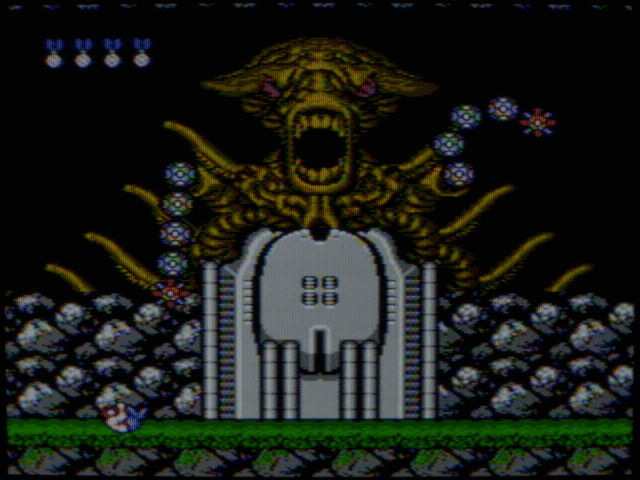
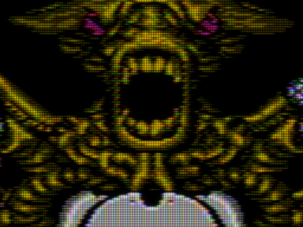
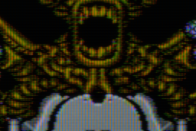

# NTSC phase and motion review

The alternating picture is part of the presentation. Two-frame averages are useful for examining colour and beam shape, but hide the frame-to-frame chroma structure. The README now leads with an **unaveraged animation**, with still comparisons below it.

## Watch the phases

[](images/motion/boss-sony_pvm_14l2.mp4)

[](images/motion/boss-stass_favourite.mp4)

These GIFs preserve 24 individual rendered frames with one fixed 256-colour palette and no dithering. Each frame lasts 20 ms: **50 fps**, making the excerpt approximately 20% longer than those same frames at the live 60.1 fps cadence. This avoids relying on 10 ms GIF frames, which some players clamp. They loop after 0.48 seconds; that loop is an export choice, not evidence that RF noise repeats in the emulator. GIF palette reduction also loses some mask/chroma detail.

Watch the actual frame cadence:

- [Synchronized Sony-versus-RF comparison, four seconds](images/showcase/sony-vs-rf.mp4).
- [Five-game showcase reel, 20 seconds](images/showcase/showcase-reel.mp4).
- Individual Contra phase clips: [Sony, four seconds](images/motion/boss-sony_pvm_14l2.mp4), [Stas RF, four seconds](images/motion/boss-stass_favourite.mp4), [JVC, two seconds](images/motion/boss-jvc_d_series_2000.mp4), [Toshiba, two seconds](images/motion/boss-toshiba_14af43.mp4). All run at 60.0988 fps.

MP4 uses H.264, CRF 16, 4:2:0 for common-player compatibility; it can soften fine chroma. These **lossless RGB animated details** avoid that conversion and preserve near-native cadence through cumulative 16/17 ms WebP durations:




## What the sequences show

At 960×720, alternating colour fringes are visible around the teeth, shoulder highlights and other fine edges. Sony retains the strongest local alternation of the four in this scene; JVC and especially Toshiba smooth it more. Stas adds visibly less orderly fine texture and convergence. These differences disappear or diminish in the two-phase average.

The frozen boss provides a useful separation of signal motion from game motion. Across the initial 120-frame measurement, median adjacent-frame linear RGB RMS was 0.0491 for Sony, 0.0398 for JVC, 0.0289 for Toshiba and 0.0405 for Stas. Yet the largest channel's peak-to-peak whole-image mean changed by less than 0.0008 in every profile. The change is principally local, rather than a large global exposure pulse. This does **not** measure perceived flicker on a particular panel.

This review inspected consecutive frames and measured the sequence; direct browser playback inspection was unavailable in the review environment. It does not claim a human-equivalent judgment of motion on the built-in MacBook panel. Playing the clips can also introduce player/display cadence conversion, independently of emulator timing.

## Scrolling and sprites

Real Contra attract-mode frames **900–1019** add scrolling terrain, animated soldiers and projectiles to the phase test. [Sony clip](images/motion/contra-gameplay-sony_pvm_14l2.mp4) · [Stas RF clip](images/motion/contra-gameplay-stass_favourite.mp4).

The inspected sequence shows terrain moving across a fixed output mask. Sony keeps the harder edges; Stas spreads moving detail more broadly. Neither sampled sequence shows a long retained copy of the terrain, although this short review is not a measured phosphor-decay calibration.

[Sequence measurements](gpu-motion-metrics.json) include all source frame numbers and per-frame light statistics. Those initial measurements cover 120-frame clips; the new showcase and side-by-side comparison use 240-frame captures.

## Capture method

All clips use the actual GPU path, Panel-pixels mask alignment, a 960×720 offscreen drawable and common 0.7 linear exposure before sRGB encoding. The boss input is frozen, while the carrier phase, noise and temporal state continue advancing. The extended Sony/RF captures verify every frame from 60 through 299 without gaps. Screenshot readback may run slower than real time; the exported video uses emulated-frame cadence, not disk-write timestamps. No optical-flow interpolation or frame averaging is applied.

```sh
./build/bin/mynes_gpu --simulate-frame /path/to/contra-boss.bin \
  --offscreen 960x720 --mask-alignment pixels --preset sony_pvm_14l2 \
  --screenshot-after 60 --screenshot-frames 120 --screenshot-path /tmp/boss.ppm
```

The linear PFM companions are the source for the fixed-exposure previews. [All-preset still comparison](contra-preset-gallery.md) and [pipeline limitations](gpu-pipeline-reference.md) provide the spatial/hardware context.
