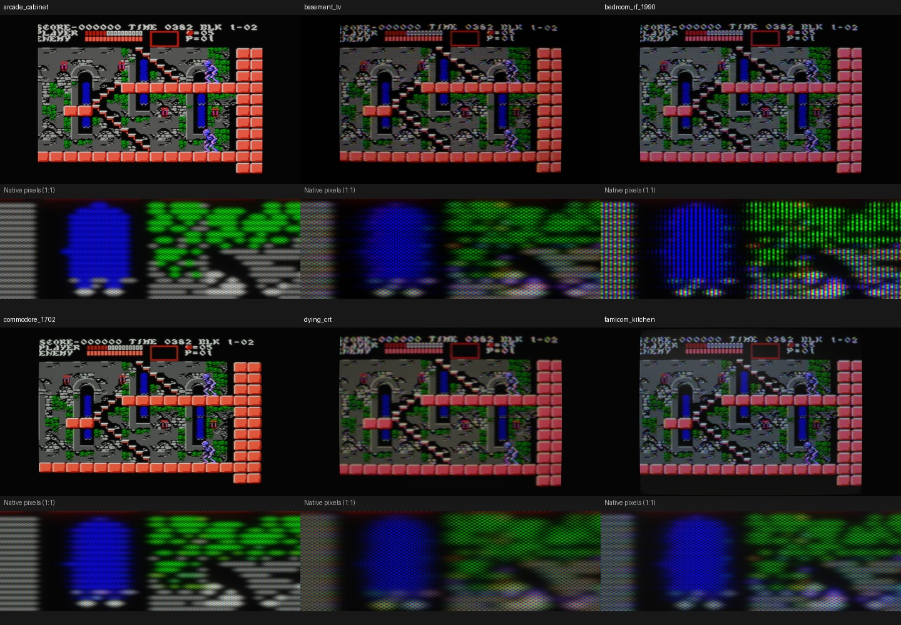
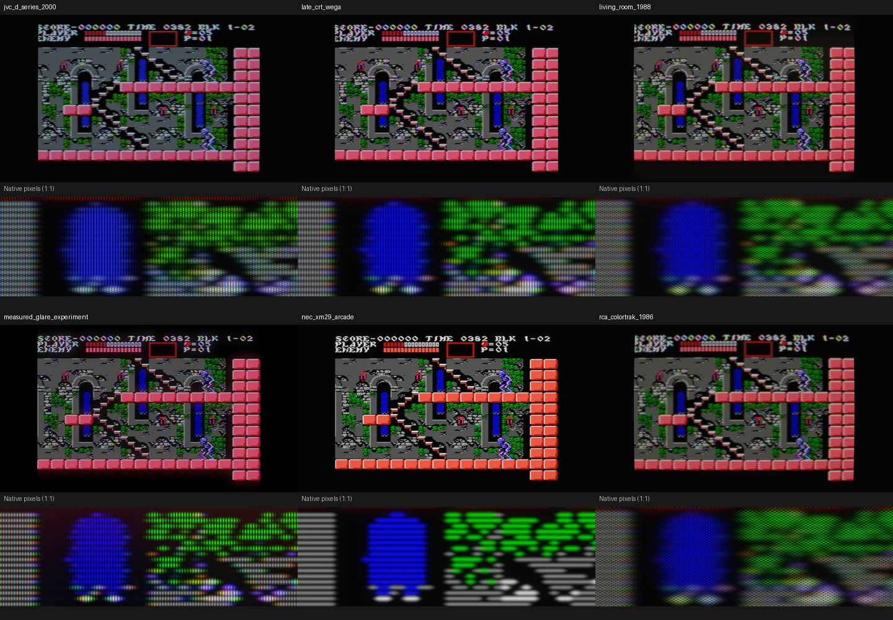
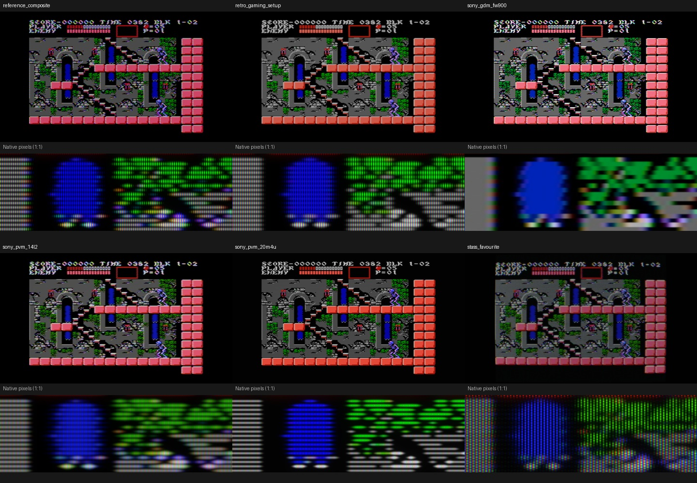
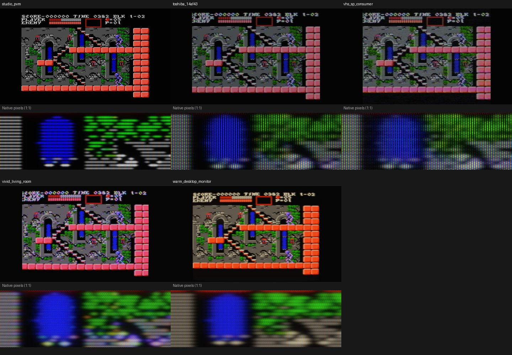

# CRT preset review — 23 looks at 4K

Reviewed and retuned **22 September 2026**, using renderer/core commit `a0f5436`.
The [visual feature tour](crt-feature-tour.md) presents the results as comparisons.
Generic presets are judged on visual appeal, distinct character and coherent
behavior. They do not need to imitate a named television. Named hardware
profiles have the additional obligation to distinguish published evidence from
assumptions. Reference and lab profiles serve a different purpose again.

## What was actually rendered

Every shipped preset received the same Castlevania III BLK 1-02 framebuffer,
a grayscale/colour/detail chart, and an isolated-scanline chart at
**3840×2160**, SDR, physical CRT mask pitch. Three consecutive frames per input
were captured: **207 initial full-resolution images**. Four tuned presets were then
re-rendered on all three inputs (36 replacement captures). Separate 4K grid,
focus, black-signal and 48-frame noise fixtures support the feature tour. Frames 30 and 32 have the same
carrier phase; frame 31 retains the other phase. No phase averaging, extra
exposure correction or individual preset adjustment was used.

The 4:3 television image occupies 2880×2160 inside the UHD target. FW900 uses
its separate 16:10 face with a 4:3 game inside it. Overview thumbnails are for
navigation; the adjacent crops show native pixels. Lossless native game,
colour-field and beam crops are retained under
[`images/preset-audit-4k`](images/preset-audit-4k).
[Settings and patch measurements](preset-audit-4k.json) record the source hashes.
Full 4K PNGs and render logs are local artifacts in
`/tmp/mynes-preset-audit-4k/{game,chart,beam}`.

Reproduce with:

```sh
python3 tools/review/audit_presets.py --game-codes /path/to/256x240-palette-frame.raw --publish docs
```

This establishes spatial appearance and short-run frame variation. It does not
measure physical panel luminance, prove flicker-free playback, or validate long
VHS transport motion/phosphor decay. The earlier Contra gallery is an explicitly
[historical snapshot](contra-preset-gallery.md), not evidence of current tuning.

## Assessment of the shared engine

**Backgrounds and black:** all 23 current gameplay renders retain the castle
walls and palette detail; no preset loses that background in this fixture.
The neutral PVM's chart code `$10` averages 0.350 relative linear luminance in
the sampled patch; Reference composite is 0.332. These are mid-grey codes,
not peak white. There is no evidence here for a blanket brightness boost.
Basement and Dying deliberately lower it to 0.206 and 0.184. Their muted picture
is part of the look, although Dying sacrifices considerable legibility.

The tube surround is still simple. `ambient_light * 0.15` contributes uniform
reflected light, including the surrounding clear area. It is not a modeled
plastic bezel, room or cabinet. The fixed glass aperture and raster are now
separate, but an unlit tube face, bezel and background environment do not yet
have independently convincing materials. That is a larger experiential gap
than adding another generic colour-temperature preset.

**Noise:** RF and tape noise exist and change between same-phase frames.
They are more visible in midtones than near black. Basement's same-phase
grey-patch difference RMS is 0.0180; Bedroom is 0.0154. Their black-patch values
are about 0.000072 and 0.000063. A quiet black is not proof that noise is absent,
and clean RF reception is a valid condition.

VHS previously had a black-patch difference of approximately 0.000001—almost
entirely hidden by gun cutoff. This review raises playback luma grain RMS
from 0.008 to 0.018 and receiver brightness from 0 to 0.08, then lowers luma
contrast from 1 to 0.94 to restrain highlights. **Black variation is now
0.00119**, with mean linear Y 0.00274; mid-grey variation is 0.00899. White
changes from 0.4314 to 0.4348, less than 1%. No post-display noise is added.
The bias is an authored slightly lifted playback/TV operating point, not a
universal VHS black level or a repaired magnetic-tape/clamp circuit model.
Normal NES black `$0f` and below-black `$0d` are separate chart patches;
`$0d` remains cut off, as intended.

VHS chroma delay also increases from 140 ns to 250 ns (about 1.34 NTSC NES
pixels nominally). This emphasizes the already separate bandwidth, tail,
peaking and transport stages without increasing geometric instability.
The [48-frame animation](images/feature-tour/noise.webp) retains consecutive
frames, slowed fourfold for inspection. Two-frame differences here are relative
final-render luminance, not calibrated SNR; settling and geometry may contribute.

**Beam and highlights:** the isolated-line captures show useful distinctions
between focused monitors, ordinary consumer sets and the broad Dying tube.
Consumer bright spots grow; bandwidth loss remains horizontal before tube
spreading. Finite vertical beam width is legitimate. Gaussian spots and their
current-growth curves are still approximations. The phosphor pattern should
not be erased merely because a beam gets wider: light spreads across a fixed
mask, and optical scatter softens what the viewer sees afterward. The current
coarse masks remain conspicuous in bright fields; optical refinement should
be evaluated separately from spot growth. SDR compression of local phosphor
peaks also affects appearance and prevents treating these captures as HDR tests.

**Mask sampling:** 4K helps, but a 2880-pixel-wide game contains only 2.4 host
pixels per 1200-triad Fine grille and 2.69 per 1070-triad PVM grille. Individual
RGB stripes cannot all remain cleanly resolved. The physically filtered grille
is therefore restrained; it must not be made coarser just to look more obvious.
Panel-pixels alignment is an available aesthetic compromise, whereas this
review uses physical pitch. Coarse dot masks in Basement/Kitchen/Dying remain
strongly visible at native size. That texture is a valid generic style, not a
claim about the mask of every period household set.

**Curvature:** household profiles have clear rounded raster geometry; Toshiba
is nearly flat, and FW900 is flat. The coefficients are image-domain warps,
not glass radii in metres. In particular, the reflection shader does not derive
reflection direction from those surface normals. “Curved picture” and “curved
glass in a room” remain different levels of modeling.

**Glare and ambiance:** all 23 presets initially had external `glass_glare = 0`.
This review gives Kitchen a broad cool reflection (0.005, 6000 K), Living Room
a faint warm lamp (0.0025, 3200 K), and Warm Desktop an amber desk light
(0.003, 3000 K). Each was checked with a black signal, colour chart, isolated
beam and gameplay at 4K. Other looks retain their previous room conditions.
Internal scatter/halation remains separate from these external reflections.

These are authored generic environments. The room shader is still a procedural
gradient plus a broad light shape; it is not a measured room, glass-surface
ray tracer or cabinet model. Ambient/room controls could usefully become
separable from tube identity so users can keep a favourite tube in another room.

**Decoder, sharpness and motion:** clean Y/C and RGB profiles stay clean;
composite/RF produce edge colour, and the comb profiles preserve more neutral
detail. They are distinct signal paths, not just different palettes. Exact
commercial decoder/sharpening circuits remain incomplete; the
[sharpening worklist](gpu-sharpening-audit.md) states those limits. Phosphor decay
is frame sampled, and FW900 does not perform an 85 Hz temporal conversion.
A PAL game selects a generic PAL receiver fallback even for nominal North
American consumer profiles; that is usability, not a claim those sets accepted
PAL. The separate [presentation validation](architecture/gpu-realism-validation.md)
records visible host timing and its remaining occasional misses.

## Every preset: character, weaknesses and disposition

| Preset | 4K assessment and disposition |
|---|---|
| **Arcade Cabinet** | Crisp, bright RGB artwork; coarse dots and clear raster add cabinet character. Slight rounding and a modest ambient pedestal. Keep the clean arcade alternative; it is an ideal RGB source, not a stock NES or PlayChoice palette. A cabinet surround would strengthen the name more than extra composite damage. |
| **Basement TV** | Darker, softly rounded, visibly noisy RF with broad but identifiable scanlines. No longer the old indiscriminate heavy static overlay. Keep as a worn, subdued vibe; dimness is intentional, but inspect dark games before reducing contrast further. |
| **Bedroom RF 1990** | Strong domestic-NES identity: RF edge colour, cool grey, slot-mask texture and a visible raster at 4K. Mild curvature and overscan fit the concept. Keep as a principal generic choice; do not replace its character with PVM cleanliness. Black snow is subtle relative to midtone noise. |
| **Compact video monitor** | Clean Y/C boundaries and tighter detail than the RF sets, with a modest curved dot-mask face. Keep the compact-monitor niche. The compatibility filename `commodore_1702` is not its displayed identity or evidence of a modeled 1702 circuit. |
| **Dying CRT** | Most defocused/warm-weakened picture, very broad bright strokes and muted contrast. Distinct and useful as an extreme aging look, but too destructive as a general recommendation. Keep the expressive name; not every worn tube behaves this way. More defects are unnecessary. |
| **Famicom Kitchen** | Cool, coarse, softly focused RF picture with grey tracking and modest curve. Has its own character; keep. A broad, cool kitchen-light reflection now gives the dark glass its own atmosphere. Receiver noise stacks with RF noise; any future retune should preserve distinct roles. |
| **JVC D-Series (nominal)** | Good balanced consumer choice: cool highlights, clean low-frequency detail, slot texture and restrained curve. Keep among the main choices. Two-line separation is useful, but colour, spot and optics are estimated rather than a factory calibration. |
| **Late consumer aperture grille** | Firm composite image, visible grille, wider bright lines and less horizontal bow. Keep the generic identity; the strong notch-decoded edge colour is a deliberate receiver character, not evidence of a particular WEGA. Its old boilerplate description is replaced with the actual look. |
| **Living Room 1988** | Rounded, neutral household composite with a softer dot-mask raster. Pleasant baseline nostalgia. Keep the name and character; it overlaps the large warm consumer profile but is less warm/soft. A faint warm evening reflection now distinguishes its room setting without adding noise. |
| **Lab: measured glass scatter** | Reference composite plus a wider measured-fit spill kernel. The surrounding light around bright patches is the point; it is not a complete television. Renamed from “Measured glare experiment” and given an explicit comparison description. Keep as a lab tool, not a headline vibe or a falsely named Hitachi set. |
| **Large RGB monitor** | Very clean, tightly focused, sharper than Arcade, with subdued fine mask texture and little curve. Keep as the big clean-RGB alternative. No NEC hardware identity is claimed despite the legacy filename. |
| **Large consumer shadow mask** | Warm, broad, rounded, mellow composite. Keep as a cozy large-screen vibe; the softness makes it distinct at native size even where an overview resembles Living Room. Updated the generic boilerplate description accordingly. |
| **Reference composite** | Dark-room baseline, flat geometry, no wear noise, strong native composite edge signature. Keep for comparisons. “Reference” means a neutral pipeline baseline, not a claim to be the most accurate commercial monitor or the cleanest decoder. |
| **Clean consumer grille** | Clean Y/C consumer grille, moderate beam and little curve, quiet background. Good easy-playing look, but the name is vague. Renamed from “Retro Gaming Setup” to explain that difference; the filename stays compatible. |
| **Sony GDM-FW900 + scaler** | The cleanest continuous-looking raster, markedly different tone response and largely unresolved fine grille. Keep: a high-resolution PC monitor with a scaler should not be forced to show broad 240-line gaps. The generic upstream composite decoder still fringes edges. Empirical spatial/tonal model; no measured full optics, 85 Hz conversion or complete FW900 electronics. |
| **Sony PVM-14L2 (nominal)** | Strong monitor identity: focused bright beam, restrained geometry, neutral greys and cleaner composite detail. Keep as the main hardware-informed monitor. Full-resolution highlights are not uniformly “too dim” in this check. Grille/size/bandwidth have published backing; beam/decay and much of the receiver remain approximate. |
| **Fine aperture grille** | Very narrow Y/C raster, deep gaps and fine texture. Keep for users who like a clinical, sharply separated raster. At this 4K viewport its colour stripes are already partly unresolved; do not mistake that for a missing mask. Significant overlap with Studio at smaller sizes. |
| **Stas’s Favourite** | Distinct worn slot-mask RF: muted cool picture, imperfect tracking, broad highlights and recovery. Keep the personal name and tuning. Slow AGC, noise and load behavior need longer clips for judgment; this short still test is not proof of their temporal accuracy. |
| **Studio aperture grille** | Quiet Y/C, crisp raster and a slightly less extreme beam than Fine grille. A good clean-monitor vibe. Keep both for now; describe the distinction instead of inventing separate Sony identities. |
| **Toshiba 14AF (nominal)** | Soft consumer beam, near-flat face, slot texture and smoother composite colour. Strong complementary choice to JVC/PVM. Keep the broad spot; exact tone/sharpness and phosphor behavior remain estimates. |
| **VHS SP playback** | Clear horizontal chroma softening and trailing colour, with Toshiba's broad slot-mask tube. A coherent tape look. Shadow grain is now visible after the bias/noise retune, and colour delay is clearer. Shortened the menu name, retaining the filename. No claim that all decks have the same delay, snow or black level. |
| **Vivid Living Room** | Lively, cool, colourful composite with visible edge colour and more light spill. Keep as a preference preset; saturation and glow need not match a factory mode. It should remain more exuberant than neutral Living Room. |
| **Warm Desktop Monitor** | Warm whites, clean Y/C colour and a softer dot-mask face. Distinct, comfortable and worth keeping. Preserve the warmth rather than normalizing every profile to D65; a soft amber desk-light reflection now completes the generic room setting. |

## Current physical settings

These are the current JSON settings, not measured tube specifications.
FWHM is the configured dark-to-bright vertical beam width in source lines;
FW900 replaces that generic path with its measured raster response. Curvature
values are horizontal/vertical coefficients; vertical zero follows horizontal.
Room values list ambient / external glare. Scatter lists halo fraction / width
as a fraction of picture height; zero width means the legacy 0.006 kernel.

| Preset | Input / face | Triads | FWHM | H/V curve; overscan per edge | Ambient/glare | Halo/width |
|---|---|---:|---|---|---|---|
| Arcade Cabinet | rgb / shadow | 440 | 0.4–1.05 | 0.01/0.012; 1.2% | 0.01/0 | 0.03/0 |
| Basement TV | rf / shadow | 340 | 0.48–1.1 | 0.05/0.08; 2% | 0.002/0 | 0.05/0 |
| Bedroom RF 1990 | rf / slot | 410 | 0.4–0.95 | 0.05/0.06; 2% | 0.006/0 | 0.04/0 |
| Compact video monitor | svideo / shadow | 520 | 0.42–0.9 | 0.035/0.04; 0% | 0.01/0 | 0.04/0 |
| Dying CRT | composite / shadow | 350 | 0.76–1.68 | 0.045/0.05; 2% | 0.01/0 | 0.06/0 |
| Famicom Kitchen | rf / shadow | 380 | 0.6–1.3 | 0.045/0.05; 1.8% | 0.01/0.005 | 0.07/0 |
| JVC D-Series (nominal) | composite / slot | 661 | 0.46–0.98 | 0.025/0.019; 1.2% | 0.008/0 | 0.025/0 |
| Late consumer aperture grille | composite / aperture_grille | 680 | 0.46–1.05 | 0/0.03; 1.2% | 0.01/0 | 0.03/0 |
| Living Room 1988 | composite / shadow | 440 | 0.58–1.22 | 0.04/0.05; 1.8% | 0.01/0.0025 | 0.04/0 |
| Lab: measured glass scatter | composite / aperture_grille | 650 | 0.38–0.78 | 0/0; 0% | 0/0 | 0.04829/0.03017 |
| Large RGB monitor | rgb / shadow | 760 | 0.38–0.75 | 0.008/0.009; 0% | 0.01/0 | 0.02/0 |
| Large consumer shadow mask | composite / shadow | 400 | 0.62–1.35 | 0.05/0.06; 1.2% | 0.01/0 | 0.04/0 |
| Reference composite | composite / aperture_grille | 650 | 0.38–0.78 | 0/0; 0% | 0/0 | 0.02/0 |
| Clean consumer grille | svideo / aperture_grille | 620 | 0.44–0.88 | 0.005/0; 0% | 0/0 | 0.02/0 |
| Sony GDM-FW900 + scaler | composite / aperture_grille | 0 | measured PC raster | 0/0; 0% | 0/0 | 0/0 |
| Sony PVM-14L2 (nominal) | composite / aperture_grille | 1070 | 0.38–0.9 | 0.006/0.007; 0% | 0/0 | 0.02/0 |
| Fine aperture grille | svideo / aperture_grille | 1200 | 0.28–0.52 | 0.005/0.005; 0% | 0.004/0 | 0.02/0 |
| Stas's Favourite | rf / slot | 440 | 0.55–1.42 | 0.05/0; 0% | 0.002/0 | 0.05/0 |
| Studio aperture grille | svideo / aperture_grille | 900 | 0.32–0.6 | 0.005/0.006; 0% | 0.004/0 | 0.02/0 |
| Toshiba 14AF (nominal) | composite / slot | 480 | 0.6–1.2 | 0.002/0.002; 2.2% | 0.008/0 | 0.035/0 |
| VHS SP playback | composite / slot | 480 | 0.6–1.2 | 0.002/0.002; 2.2% | 0.008/0 | 0.035/0 |
| Vivid Living Room | composite / shadow | 480 | 0.55–1.15 | 0.04/0.05; 1.8% | 0.01/0 | 0.08/0 |
| Warm Desktop Monitor | svideo / shadow | 520 | 0.54–1.1 | 0.035/0.04; 0% | 0.01/0.003 | 0.05/0 |

FW900's zero generic triad count selects its separate physical pitch model,
not a missing grille. Other controls and effective defaults are explained below.

## 4K visual index

These sheets combine a reduced whole-screen view and an unscaled native crop.
Use the lossless native PNGs for fine mask judgments; JPEG sheets are navigation.






## Follow-up priorities

- Preserve the distinct generic and personal looks. Hardware provenance is not
  a prerequisite for an enjoyable preset; invented calibration claims are.
- Give the room, unlit face and surround distinct treatment. Author a few
  intentional room vibes, with optional reflections, separately from tube setup.
- Extend tape transport/clamp validation with longer moving sequences. The
  shadow-grain retune is a preset operating-point change, not a full VCR circuit.
  Keep signal noise separate from screen-space effects.
- Place lab comparisons together when preset categories are introduced. This
  review clarifies the lab, clean-consumer and tape names while keeping stable
  filenames so saved setups continue to load.
- Extend the named profiles' input-specific sharpening and decoder behavior
  where circuit evidence exists. Generic looks may keep generic responses.
- Validate longer motion/noise sequences and live HDR separately. These SDR
  spatial comparisons are not a replacement for display-timestamp testing.

## Setting-by-setting disposition

The following groups the main saved settings; the linked JSON manifest contains
the complete per-preset values. Zero-valued service/diagnostic controls are intentional: normal operation should not include an unrelated collection of defects. The values in the preset files are the authoritative editable settings.

| Settings | Interpretation and review decision |
|---|---|
| `name`, `description` | State generic identity and avoid commercial-model calibration claims. |
| `connection`, `comb_type`, `comb_notch_depth`, `region` | Composite/RF retain modulated colour; Y/C and RGB are ideal modifications. Sony uses adaptive composite separation, JVC two-line and Toshiba three-line; older profiles retain their notch/separated-source choices. Commercial IC transfer functions remain approximate. Live ROM region takes precedence over a preset. |
| `console_variant`, `speaker_type` | Select nominal audio filters and generic speaker families; not a change to the emulated PPU or CPU. |
| `console_amp_bw`, `console_coupling_R`, `console_psu_hum`, `console_phase_distortion_ns` | Generic output pole/source impedance and supply pickup; NTSC profiles use the published 30 ns 2C02G phase-distortion estimate. 6 MHz is a nominal equivalent pole, not a measured chip-wide specification. The imported `console_coupling_C` field is inactive and omitted from shipped profiles. |
| `video_cable.length_meters`, `resistance_per_m`, `capacitance_per_m`, `connector_resistance`, `impedance` | Passive equivalent shunt-capacitance response. Does not claim skin/dielectric loss or full transmission-line propagation. Nominal 75 Ω termination and plausible short-lead values. |
| `video_cable.shield_effectiveness`, `ghost_delay`, `ghost_level` | Generic pickup strength and optional echo in signal samples. No calibrated shielding-to-noise transfer. Basement and Bedroom RF leads have small explicit echoes. |
| `video_cable.num_sections`, `audio_cable.num_sections` | Legacy metadata; GPU video uses one equivalent pole, not a distributed ladder. Not exposed as a working GPU control. |
| `rf.enabled`, `mod_bandwidth`, `agc_attack_ms`, `agc_release_ms` | Enable the baseband RF model, its FIR and sync-keyed gain dynamics. Bandwidth now updates on preset load. Equivalent AM/IF processing, not a complete physical tuner. |
| `rf.carrier_freq`, `carrier_level_dbm`, `noise_floor_dbm` | Frequency is metadata. Carrier/noise power difference sets complex Gaussian noise before an equivalent negative-AM envelope detector; total noise is defined at that injection point. This is not a measured tuner noise figure. |
| `brightness`, `contrast`, `chroma_gain` | Receiver voltage-domain controls. Black and white checks use neutral baselines; worn preferences and the tape-playback look retain deliberate black/contrast changes. |
| `tv.luma_bandwidth`, `chroma_bandwidth`, `fir_ringing`, `luma_peaking`, `luma_notch_depth` | Receiver separation and frequency response. RF/household chroma is narrower than clean Y/C. Ringing/peaking is modest outside deliberately worn receivers. |
| `tv.hue_offset`, `saturation`, `color_temperature`, `r_drive/g_drive/b_drive`, `r_cutoff/g_cutoff/b_cutoff`, `color_killer` | Decoder adjustment, nominal white point, per-gun balance and burst gate. Clean monitors stay neutral; small household tint errors are explicit. |
| `tv.r_bandwidth/g_bandwidth/b_bandwidth`, `gamma` | Gun-voltage bandwidth followed by current transfer. Generic equivalent responses; PVM-14L2 uses Sony's 10 MHz RGB figure. |
| `tv.beam_fwhm_min`, `beam_fwhm_max`, `beam_spot_size`, `bloom_gamma`, `edge_focus`, `velocity_dim` | Spot dimensions, current growth and edge behaviour. FWHM is in scanlines; horizontal sigma remains in signal samples. Bright consumer spots can fill the gaps; focused monitors retain more separation. Gaussian spots omit measured non-Gaussian high-current tails. |
| `tv.convergence_static`, `convergence_dynamic`, `conv_r_x/conv_b_x`, `conv_r_y/conv_b_y` | Small central/edge gun landing errors, larger for worn tubes. Legacy horizontal offsets use signal samples; vertical/generic offsets use drawable pixels, so this part is not a physical millimetre calibration. Nominal PVM is aligned. |
| `tv.beam_current_load`, `video_black_droop`, `video_recovery_us`, `hv_sag`, `focus_breathing` | Causal video-rail/DC restoration and shared supply response. Positive size response contracts the raster; negative expands it. Generic couplings/time constants, not a circuit-component fit. |
| `tv.barrel`, `barrel_v`, `overscan`, `keystone`, `rotation`, `skew_x/skew_y`, `h_pos/v_pos`, `h_size/v_size` | Tube/raster geometry. Household overscan is modest. No preset needs a tilted, sheared trapezoid. Dying CRT is now stable. |
| `tv.h_jitter`, `v_jitter`, `rf_interference`, `geometry_warp`, `scanline_wobble`, `hum_bar_amplitude` | Small explicit timebase/supply faults for worn sets. Decorative quantized RF displacement and sinusoidal line wobble are off throughout the library. |
| `tv.beam_edge_fade`, `beam_edge_overshoot`, `burst_lock_drift`, `burst_lock_drift_width` | Legacy source/edge diagnostics; zero in all shipped presets. They are not required to give a CRT its identity. |
| `tv.mask_type`, `mask_triads`, `mask_pitch_px`, `mask_strength`, `subpixel_layout` | Physical family and total pitch, full mask coverage, host filtering. Host Panel-pixels mode fits integer periods to the current game viewport; CRT-pitch mode preserves nominal density. RGB/BGR ordering is not LCD-subpixel calibration. |
| `tv.persistence_ms`, `persistence_r/g/b`, `motion_threshold` | Generic frame-sampled decay; explicit smoothing is separate. Not a reproduction of a CRT's moving impulse beam on a 60 Hz sample-and-hold panel. Age does not automatically imply huge phosphor trails. |
| `tv.halation`, `halation_tint_r/g/b`, `glass_tint`, `vignette`, `ambient_light`, `black_floor` | Moderate optical spread, neutral scatter colour, glass throughput and room/black level. No arbitrary green glow. Ambient extends into window margins. |
| `tv.glass_glare`, `glass_glare_light_x/y`, `glass_glare_size`, `glass_glare_temp_k` | External procedural room light. Kitchen, Living Room and Warm Desktop use deliberately restrained reflections; neutral and lab comparisons retain their previous room state. Coordinates/size describe the image-space light, not a measured room. |
| `vhs.*` | Recovered luma/chroma bandwidth, colour delay, peaking/tail, signal-domain noise, transport drift, switching and sparse dropout. Generic NTSC composite/RF playback only; the current SP operating point is detailed above. |
| `tv.noise_level` | Receiver output voltage noise, before gun transfer/beam spread. RF snow is separately introduced before decoding. |
| `tv.hdr_gain` | Linear exposure before host adaptation. Does not claim measured nits; actual HDR headroom comes from SDL. |
| `audio_cable.*`, `audio_cable_length_m` | Source resistance plus wire resistance, cable capacitance and length affect the audio pole. Shielding, echo, impedance and ladder sections are compatibility metadata for audio; noise/hum are explicit separate controls. 8 Ω speaker load was removed from cable characteristic impedance. |
| `audio_psu_hum_amplitude`, `audio_noise_floor`, `audio_saturation_drive` | Explicit generic audible wear, reduced to restrained levels. Console/speaker responses are shared between CPU and GPU. |

The PVM reference is [Sony's published specification](https://www.sony.jp/pro-monitor/products/PVM-14L2/). NES signal values come from [terminated voltage measurements](https://www.nesdev.org/wiki/NTSC_video). [Video-amplifier fault descriptions](https://www.repairfaq.org/REPAIR/F_monfaq.html) support the kinds of streaking/regulation defects, not the numerical tuning of an individual preset. Further assumptions and missing physical models are listed in the [pipeline reference](gpu-pipeline-reference.md).


## Curated colour and connection defaults

| Profile | Connection | White point | R−Y / B−Y gain offset | Gun gamma | Spot growth at white |
|---|---|---:|---:|---:|---:|
| PVM-14L2 | Composite | D65 | 0 / 0 | 2.4 | 25% |
| JVC D-Series | Composite | 9300 K | +16% / −2% | 2.4, small tracking offsets | 40% |
| Toshiba 14AF43 | Composite | 8000 K | +6% / +2.5% | 2.4, small tracking offsets | 45% |
| Stas's Favourite | RF | 7800 K | +10% / −3.5% | 2.2, worn tracking | 55% |

Consumer colour settings are explicit estimates; they are not extracted factory coefficients. The JVC owner record reports cool Standard mode and red push. Toshiba's service procedure specifies visual white-balance adjustment, without establishing our 8000 K target. PVM D65 is documented. Nominal 525-line phosphor primaries are a standards-based approximation to the unmeasured tubes. Decoder colour-difference gains preserve the gray axis; gun balance and phosphor gamut act at their respective stages.

Stas uses channel-3 metadata, −25 dBm sync-tip carrier, −65 dBm injected channel noise and a 4.1 MHz equivalent video corner. RF can be selected on any display; on the tunerless PVM this represents an external receiver. Stock NES composite/RF and hypothetical modified component/RGB sources are distinct choices.

## Current control audit

All 121 saved TV fields have OSD controls, including conditional legacy focus settings. RF IF and VHS controls are saved and editable under Signal chain. The automated audit checks every shipped preset against the control ranges; this is a consistency check, not evidence that every parameter matches measured hardware. [Model validation and limits](architecture/gpu-realism-validation.md).
