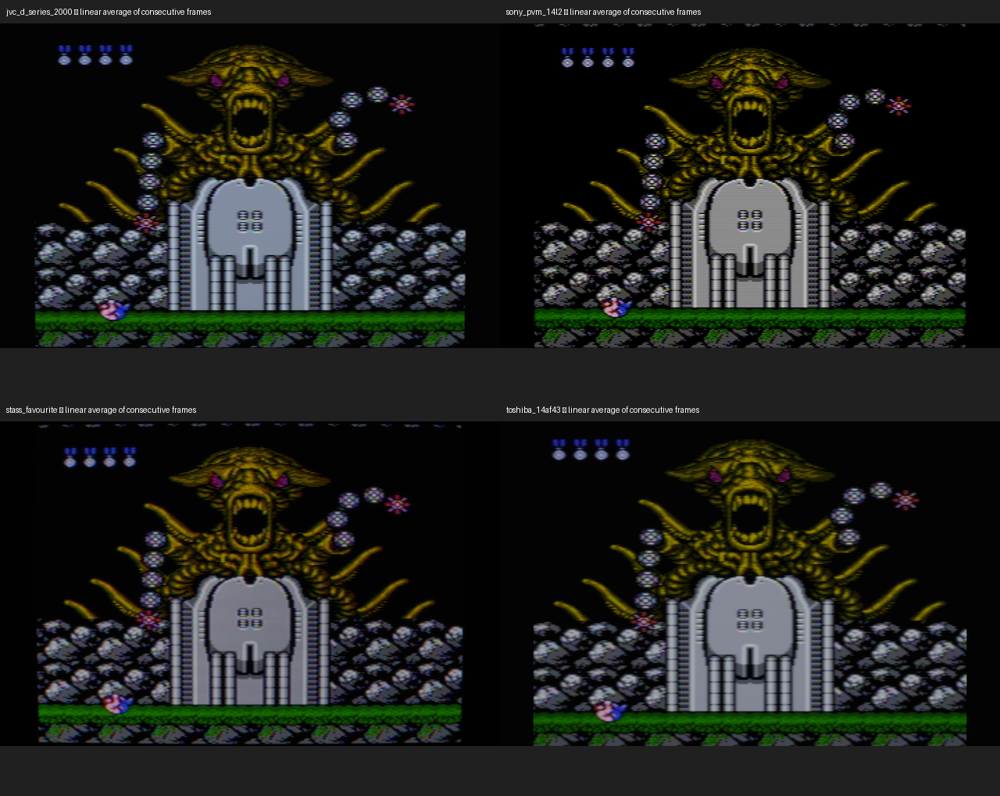
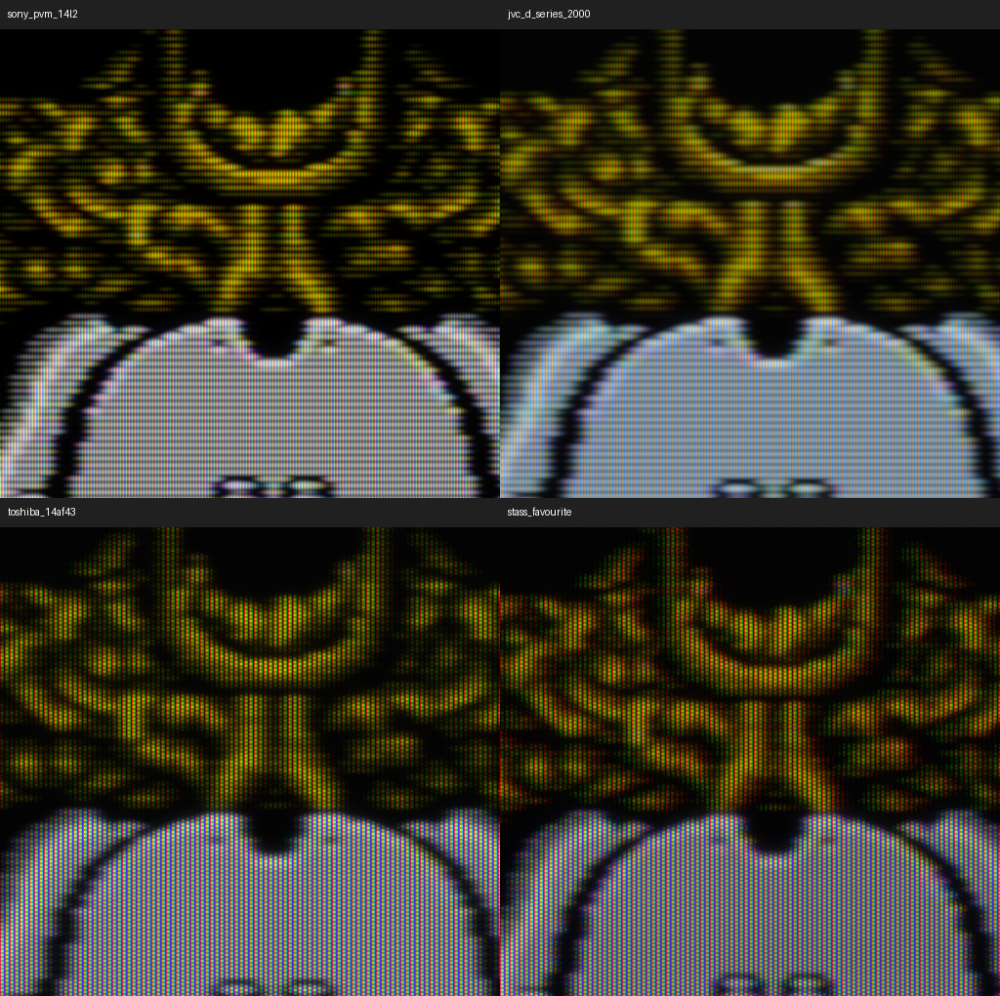
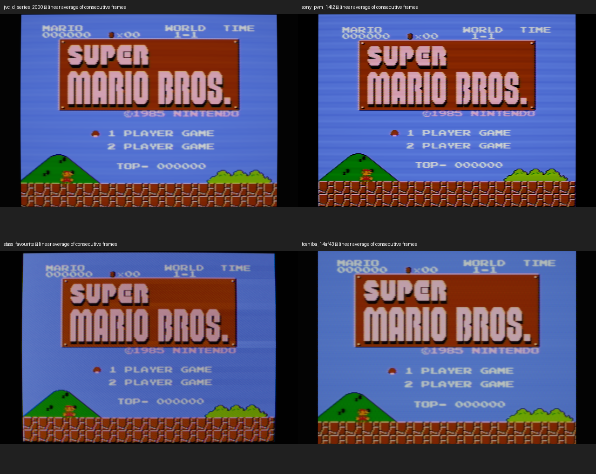
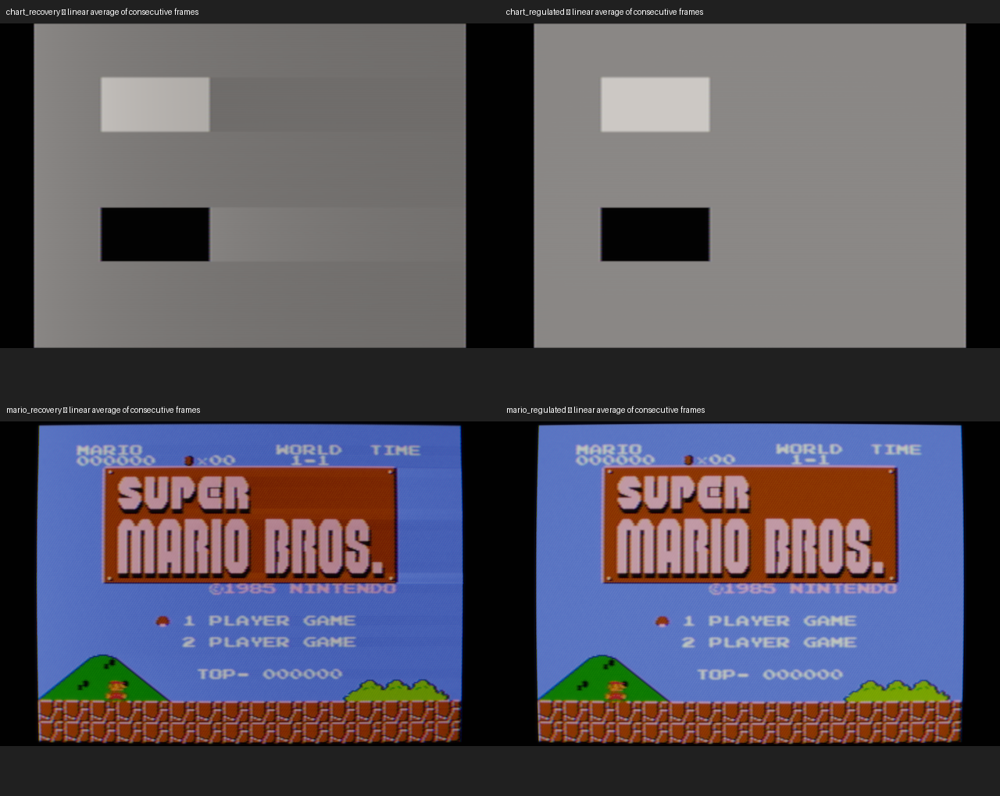
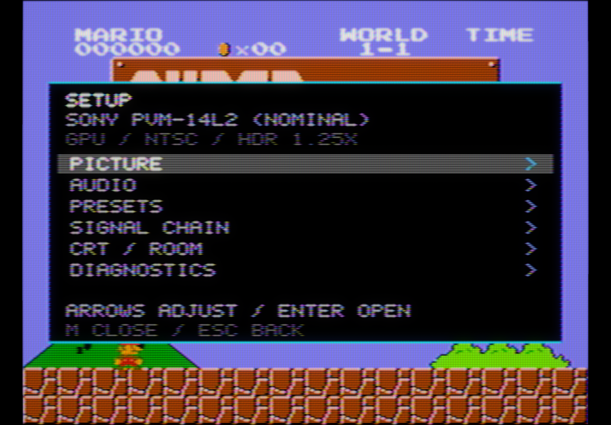

# CRT visual review — 21 September 2026

Current Contra images come from the actual SDL3 GPU pipeline at **2560×1664**, offscreen, with fixed **1.6×** output headroom. Frames 60 and 61 are averaged in **linear light**. The SDR previews use a common 0.7 exposure to retain bright phosphor detail; they do not establish actual screen luminance. Native crops are not resized.

## Same Contra boss, four displays

The fixture contains actual PPU codes from the user's Contra ROM, captured at the Waterfall boss. The supplied CRT photograph is the scene reference; player/projectile states differ. The source is not reconstructed from that photograph.

- **PVM-14L2:** fine aperture grille, neutral D65, adaptive composite separation and narrower midtone spots. Bright lines widen per gun; the nominal vertical response measures 0.388–0.900 source lines across the tested drive range. The high-contrast mask remains conspicuous in a native closeup. It is a nominal 14L2 interpretation, not a measured replica of the user's tube.
- **JVC D-Series:** two-line separation, cool white, mild decoder red push, curved consumer raster and an inline slot mask. White-point/decoder values are estimates informed by the hardware/owner references.
- **Toshiba 14AF43:** near-flat face, three-line separator and broader bright spots. Its slot pitch is an estimate. It should look like a small consumer set rather than a high-resolution PVM.
- **Stas's Favourite:** RF, modest noise, imperfect convergence and gray tracking, broad highlights and causal recovery. The previous coarse delta-dot weave obscured detail; a finer inline mask keeps vertical RGB structure. Bright/dark patch recovery and load-dependent contraction remain active.

All four have a yellow/green face and magenta-red eyes. The user's photograph has brighter, cooler platform whites and redder eyes. Exposure, camera white balance, console revision, decoder adjustment and connection are confounded. RF is plausible, but the photograph cannot identify it conclusively. We do not force every CRT to reproduce one uncalibrated camera image.

## What these captures establish

The grille is generated at the actual drawable size. Panel mode quantizes the complete RGB period; at this resolution the nominal 1070-triad PVM becomes a coarser resolved grille. Physical-pitch mode preserves the tube density and filters unresolved structure. Neither mode proves alignment to individual LCD subpixels. Viewing a crop at a different scale can change the apparent mask.

GPU regressions independently check neutral mask mean, nonnegative coverage, RGB/BGR order, resize behaviour, linear HDR handling, beam energy and gun-independent growth. A 48-frame RF test found maximum absolute decoded-gray noise correlation of 0.0054 at lags 1–12; final-image investigation of the reported cyclic texture continues.

## Earlier supporting captures

These supporting images predate the latest colour/inline-mask changes. The isolated recovery chart shows a darker wake after white and a brighter wake after black. Stas retains this upstream voltage response; the regulated PVM does not acquire an artificial worn-TV streak.

The OSD groups the physical stages and shows preset/modified state, region, output mode and headroom. The screenshot predates the latest control labels.

## Limits and next comparisons

Full renders are inspected alongside real photographs of the named displays, with [evidence and assumptions recorded separately](gpu-hardware-research.md). Beam and decoder parameters are still nominal. Exact phosphor spectra, non-Gaussian spot tails, individual convergence maps and chip-specific ABL are not calibrated. The ordinary LCD hold interval also differs from a moving CRT beam. Paired stills verify spatial/phase behaviour, not motion equivalence.

The next pass checks final-image RF temporal behaviour, component colour, multiple drawable sizes and refreshed Mario/OSD captures. [Benchmarks](gpu-benchmark-results.md) distinguish complete-chain fence measurements from full real-game playback; neither timestamp is a photon-latency measurement.
