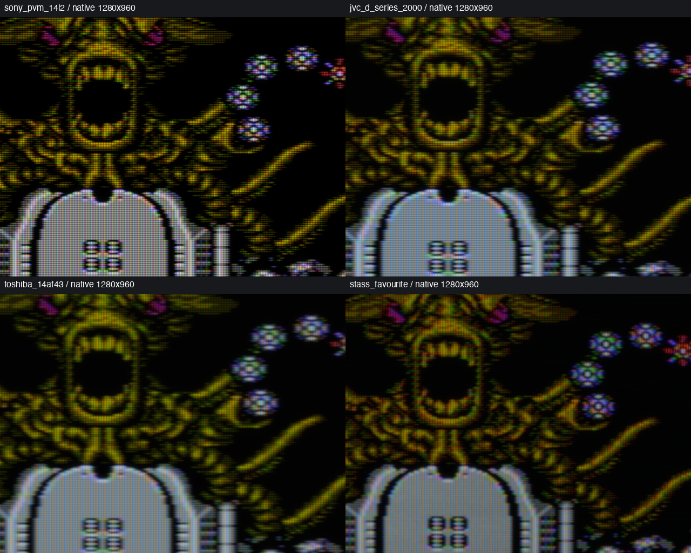
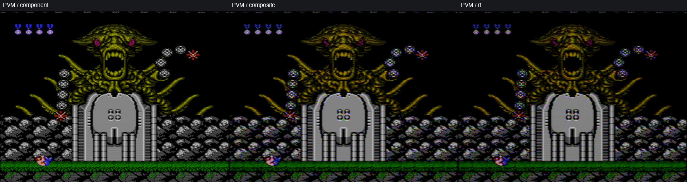

# CRT visual review — 21 September 2026

For the current presentation, see the [game showcase](nes-visual-showcase.md) and [full-resolution gameplay / beam close-ups](gpu-beam-closeups.md). This page retains controlled diagnostic comparisons at their stated capture resolutions.

Current Contra images come from the actual SDL3 GPU pipeline at **3840×2880**, offscreen, with fixed **1.6×** output headroom. Stills show frame 60 without averaging; frame 61 is captured separately for phase checks. The SDR previews use a common 0.6 linear exposure to retain bright phosphor detail; they do not establish actual screen luminance. Native crops are not resized.

## Same Contra boss, four displays

The fixture contains actual PPU codes from the user's Contra ROM, captured at the Waterfall boss. The supplied CRT photograph is the scene reference; player/projectile states differ. The source is not reconstructed from that photograph.

- **PVM-14L2:** fine aperture grille, neutral D65, adaptive composite separation and narrower midtone spots. Bright lines widen per gun; the nominal vertical response measures 0.388–0.900 source lines across the tested drive range. The high-contrast mask remains conspicuous in a native closeup. It is a nominal 14L2 interpretation, not a measured replica of the user's tube.
- **JVC D-Series:** two-line separation, cool white, mild decoder red push, curved consumer raster and an inline slot mask. White-point/decoder values are estimates informed by the hardware/owner references.
- **Toshiba 14AF43:** near-flat face, three-line separator and broader bright spots. Its slot pitch is an estimate. It should look like a small consumer set rather than a high-resolution PVM.
- **Stas's Favourite:** RF, modest noise, imperfect convergence and gray tracking, broad highlights and causal recovery. The previous coarse delta-dot weave obscured detail; a finer inline mask keeps vertical RGB structure. Bright/dark patch recovery and load-dependent contraction remain active.

All four have a yellow/green face and magenta-red eyes. The user's photograph has brighter, cooler platform whites and redder eyes. Exposure, camera white balance, console revision, decoder adjustment and connection are confounded. RF is plausible, but the photograph cannot identify it conclusively. We do not force every CRT to reproduce one uncalibrated camera image.

## What these captures establish

The grille is generated at the actual drawable size. Panel mode quantizes the complete RGB period; at this resolution the nominal 1070-triad PVM becomes a coarser resolved grille. Physical-pitch mode preserves the tube density and filters unresolved structure. Neither mode proves alignment to individual LCD subpixels. Viewing a crop at a different scale can change the apparent mask.

GPU regressions independently check neutral mask mean, nonnegative coverage, RGB/BGR order, resize behaviour, linear HDR handling, beam energy and gun-independent growth. The complex-IF GPU regression found maximum absolute decoded-gray noise correlation of 0.00632 at lags 1–12. Before the IF update, a separate 36-frame final-render gray-field test found no repeating peak (maximum absolute correlation 0.034). It removes the fixed image/mask by subtracting the temporal mean, which introduces a small negative bias. [Final-render metrics](gpu-rf-temporal-results.json). Replaying the last saved legacy RF profile with all its controls retained also did not reproduce a several-frame cycle: adjacent-frame correlation decayed rather than returning at a periodic lag. This does not identify the exact texture reported by the user; deterministic composite crawl and mask structure must remain separate from random snow.

## Drawable size and connection checks

The same four presets were also rendered at 1280×960. The mask is refitted to that actual drawable; it is not a resized full-resolution screenshot. In panel mode, fitting complete RGB periods trades exact tube density for a resolved pattern. At smaller sizes the PVM grille therefore cannot retain its physical triad count. The native crop is the useful mask check; reduced overview images can introduce their own aliasing.

The same Contra codes retain colour through component, with cleaner edges than composite/RF. Component represents an ideal decoded/modded source; the stock NES does not output component. RF here means an external receiver feeding the PVM, which has no tuner. The four curated defaults remain composite for Sony/JVC/Toshiba and RF for Stas.

## Refreshed supporting captures

These supporting images use the current colour and inline-mask models. The isolated recovery chart shows a darker wake after white and a brighter wake after black. Stas retains this upstream voltage response; the regulated PVM does not acquire an artificial worn-TV streak.

The translucent OSD groups the physical stages and shows preset/modified state, region, output mode and headroom. It is injected as RGB after color decoding, before the gun/beam stages, so its text stays free of NES decoder artifacts. Its headroom now comes from the same calculation as the renderer: offscreen review displays 1.60× and explicitly identifies the hidden drawable rather than reporting the physical screen as its target.

Enter on a parameter opens this strip without changing the value. Left/Right
adjusts it; Enter or Escape returns to the same menu row. Only the bottom region
is covered during tuning. The picture keeps running.

## Limits and next comparisons

Full renders are inspected alongside real photographs of the named displays, with [evidence and assumptions recorded separately](gpu-hardware-research.md). Beam and decoder parameters are still nominal. Exact phosphor spectra, non-Gaussian spot tails, individual convergence maps and chip-specific ABL are not calibrated. The ordinary LCD hold interval also differs from a moving CRT beam. Paired stills verify spatial/phase behaviour, not motion equivalence.

This pass checked final-image RF temporal behaviour, component colour, two drawable sizes and fresh Mario/OSD captures. Geometry reuse and direct offscreen readback preserved the reviewed pixels; screenshot encoding now runs outside the interactive render thread. [Benchmarks](gpu-benchmark-results.md) distinguish complete-chain fence measurements from full real-game playback; neither timestamp is a photon-latency measurement.
