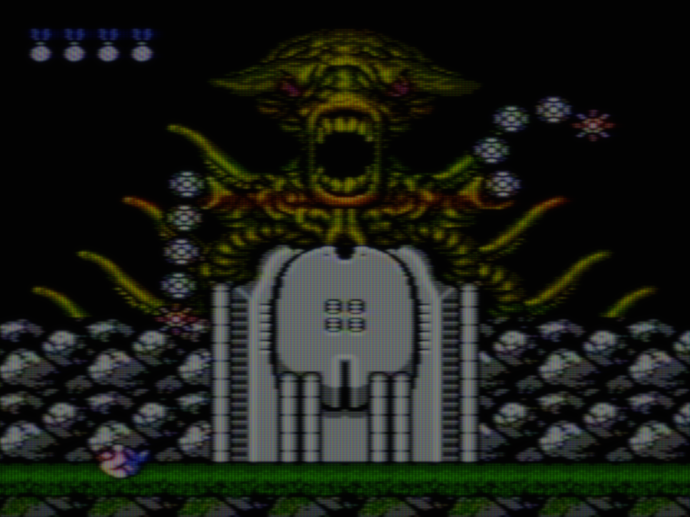

# MyNES showcase

NES games rendered through MyNES's GPU signal and CRT pipeline.

[Close-up of the same frame](images/showcase/4k/castlevania-pvm-detail.png) · [All 21 presets on Contra](contra-preset-gallery.md)

## Watch

**[▶ Five games in 20 seconds · 60.1 fps](images/showcase/showcase-reel.mp4)**

| Game | Scene | CRT preset | Video |
|---|---|---|---|
| Kirby's Adventure | Animated title and opening | JVC D-Series | [Watch](images/showcase/kirby-jvc_d_series_2000.mp4) |
| Little Samson | Mountain and palace opening | JVC D-Series | [Watch](images/showcase/little-samson-jvc_d_series_2000.mp4) |
| Darkwing Duck | Bridge gameplay | Stas's Favourite · RF | [Watch](images/showcase/darkwing-stass_favourite.mp4) |
| Super Mario Bros. 3 | Animated theatrical title | Toshiba 14AF | [Watch](images/showcase/mario-3-toshiba_14af43.mp4) |
| Mega Man 2 | Rooftop title | Sony PVM-14L2 | [Watch](images/showcase/mega-man-2-sony_pvm_14l2.mp4) |

## Look closer

[Full-resolution gameplay and native close-ups](gpu-beam-closeups.md) show the beam, grille and brightness-dependent scanline width. Full game captures are 3840×2880; the four-preset title comparison also renders the complete 4:3 image at 3840×2880.

This lossless animated detail retains the changing NTSC phases. The videos run at 60.0988 fps without frame blending. README GIF previews use 50 fps for compatibility; click through to the videos for the original cadence.

## VHS playback

*Actual GPU output · one unaveraged frame · SDR · click for the full 3840×2880 image.*

Select **VHS SP — NES recording on a consumer CRT** in **OSD → Presets**.
The composite recording/playback stage softens horizontal detail and spreads
color before the picture reaches the consumer CRT. Adjust it under
**Signal chain → VHS recording / playback**.

This is a generic recovered VHS response, not a calibrated VCR model.
The still shows its bandwidth and color effects. [Watch four seconds of unaveraged VHS playback](images/motion/boss-vhs_sp_consumer.mp4) for the residual timing and phase behavior. [Preset file](../presets/vhs_sp_consumer.json).

[Capture details](showcase-captures.json) · [CRT presets](gpu-preset-audit.md) · [Beam measurements](gpu-beam-closeups.md#does-the-beam-actually-widen)
